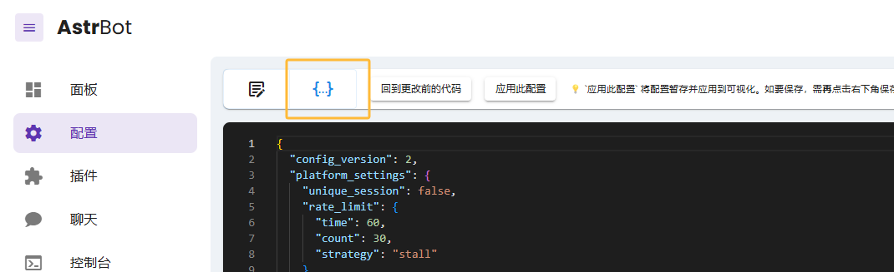
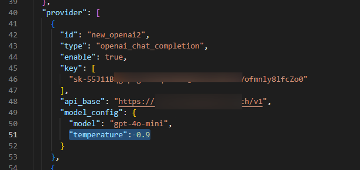

# 配置自定义的模型参数

AstrBot 的配置文件是一个 `Json` 格式的文件。AstrBot 会在启动时读取这个文件，并根据文件中的配置来初始化 AstrBot。它位于 `data/cmd_config.json` 下。

模型配置可以手动修改配置文件修改。

您可在管理面板在线修改配置文件：

也可以手动修改位于 `data/cmd_config.json` 下的配置文件。

找到 `provider`，并找到你想要修改的提供商的模型配置：

然后在 `model_config` 中添加新的参数即可。

具体的参数请看对应的提供商的文档。