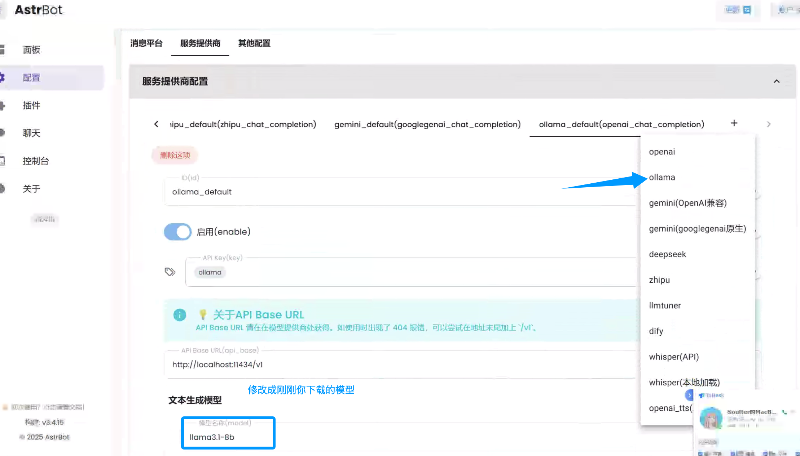

## 接入 Ollama 使用 DeepSeek-R1 等模型

Ollama 允许在本地电脑上部署模型（需要电脑硬件配置符合要求）

### 下载并安装 Ollama

https://ollama.com/

### 选择想要使用的模型

在 https://ollama.com/search 上选择想要使用的模型。

在终端上(windows 是 powershell)输入 `ollama pull <model_name>` 下载模型。

model_name 格式：`<model_name>:<model_version>`。如 `deepseek-r1:8b`。

> 8b 参数量模型需要至少 16GB 显存。有关配置和参数量的详细信息，请参阅其他文档。

拉取完成后，`ollama list` 查看已经拉取的模型。

然后使用 `ollama run <model_name>` 运行模型。

### 配置 AstrBot

在 AstrBot 上：



保存配置即可。

> 输入 /provider 查看 AstrBot 配置的模型

> 对于 Docker Desktop 用户，API Base URL 请填写为 `http://host.docker.internal:11434/v1`。


### FAQ

报错：
```
AstrBot 请求失败。
错误类型: NotFoundError
错误信息: Error code: 404 - {'error': {'message': 'model "llama3.1-8b" not found, try pulling it first', 'type': 'api_error', 'param': None, 'code': None}}
```

请先看上面的教程，用 `ollama pull <model_name>` 拉取模型。

然后使用 `ollama run <model_name>` 运行模型。