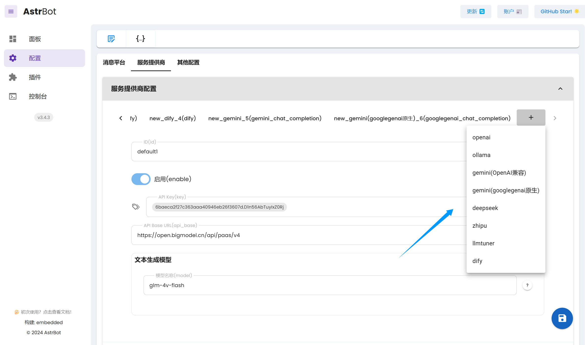

# 大语言模型提供商

本页的配置在 `data/cmd_config.json` 的 `provider` 字段中。

`provider` 字段的值是一个`列表`，列表中的每个元素都是一个类似下面的大语言模型提供商的配置。只需将其添加到列表中即可。

> [!TIP]
> 使用 `/provider` 指令可以查看、切换大语言模型提供商。
> 
> 使用 `/model` 指令可以查看、切换提供商支持的模型。（需要提供商适配）

下面所有的配置都可在管理面板可视化配置：



## OpenAI Chat Completion

适配了 OpenAI Chat Completion 接口的配置。

```json
{
    "id": "default",
    "type": "openai_chat_completion",
    "enable": true,
    "key": [],
    "api_base": "",
    "model_config": {
        "model": "gpt-4o-mini"
    }
}
```

- `key` API Key。可以填写多个，以便在一个 API Key 被限制时切换到另一个。格式如 `["key1", "key2"]`。

- `api_base` API Base URL。默认为空。为空时使用 OpenAI 官方 API。

- `model_config` 模型配置。`model` 为模型名称。你可以在这里加入更多的模型配置项，比如 `top_p`、`temperature` 等。但请注意不要填写模型不支持的配置项。

很多提供商如 Google Gemini、Deepseek、Ollama、智浦（GLM）、OneAPI 等**都适配了 OpenAI API 接口**。因此它们使用的都是 **openai_chat_completion**。只需修改 `key`, `api_base`, `model_config` 配置项即可。下面列举几个提供商的配置。

### Ollama

```json{5}
{
    "id": "ollama_default",
    "type": "openai_chat_completion",
    "enable": true,
    "key": ["ollama"],
    "api_base": "http://localhost:11434",
    "model_config": {
        "model": "llama3.1-8b"
    }
}
```

ollama 的 key 默认是 ollama。

### Gemini

对于 Gemini，有两种配置方式。一种是使用 OpenAI 兼容的 API，即 `type` 字段为 `openai_chat_completion`。另一种是使用 Gemini 的专用 API，即 `type` 字段为 `googlegenai_chat_completion`。

在管理面板可视化配置时，第一种为 `gemini(OpenAI兼容)`，第二种为 `gemini(googlegenai原生)`。

如果你正在使用某些反代项目以在中国大陆使用 Gemini，它们可能不会提供 OpenAI 兼容的API，这时候就需要使用 `gemini(googlegenai原生)`。

```json
{
    "id": "gemini_default",
    "type": "openai_chat_completion", # 或者 googlegenai_chat_completion。在复制本代码时请把这个注释删掉，否则会报错。
    "enable": true,
    "key": [],
    "api_base": "https://generativelanguage.googleapis.com/v1beta/openai/", # 如果是 googlegenai_chat_completion，这里填写 https://generativelanguage.googleapis.com 或者你的 Gemini（Palm）反代地址。
    "model_config": {
        "model": "gemini-1.5-flash"
    }
}
```

### Deepseek

```json
{
    "id": "deepseek_default",
    "type": "openai_chat_completion",
    "enable": true,
    "key": [],
    "api_base": "https://api.deepseek.com/v1",
    "model_config": {
        "model": "deepseek-chat"
    }
}
```

### 智浦 GLM

```json
{
    "id": "zhipu_default",
    "type": "openai_chat_completion",
    "enable": true,
    "key": [],
    "api_base": "https://open.bigmodel.cn/api/paas/v4/",
    "model_config": {
        "model": "glm-4-flash"
    }
}
```

## LLMTuner

AstrBot 支持加载使用 `LlamaFactory` 微调的模型。

```json
{
    "id": "llmtuner_default",
    "type": "llm_tuner",
    "enable": true,
    "base_model_path": "",
    "adapter_model_path": "",
    "llmtuner_template": "",
    "finetuning_type": "lora",
    "quantization_bit": 4
}
```

- `base_model_path` 基座模型路径。
- `adapter_model_path` 适配器模型路径。如微调好的 `Lora` 模型。
- `llmtuner_template` 基座模型的类型。如 `llama3`, `qwen`。请参考 `LlamaFactory` 的文档。
- `finetuning_type` 微调类型。如 `lora`。
- `quantization_bit` 量化位数。如 `4`, `8`。

## Dify

AstrBot 支持接入 Dify。

请参考 [接入 Dify](/others/dify)。


## Whisper 语音转文字

AstrBot 支持接入 OpenAI 开源的 Whisper 模型，实现语音转文字。

可以接入 API 版本的，也可以在本地部署 Whisper。

详见 [Whisper 语音转文字](/use/whisper)。