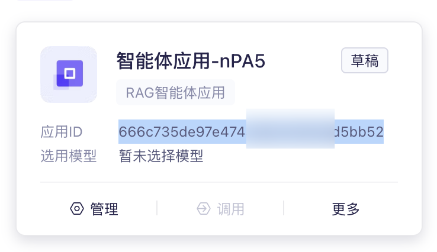
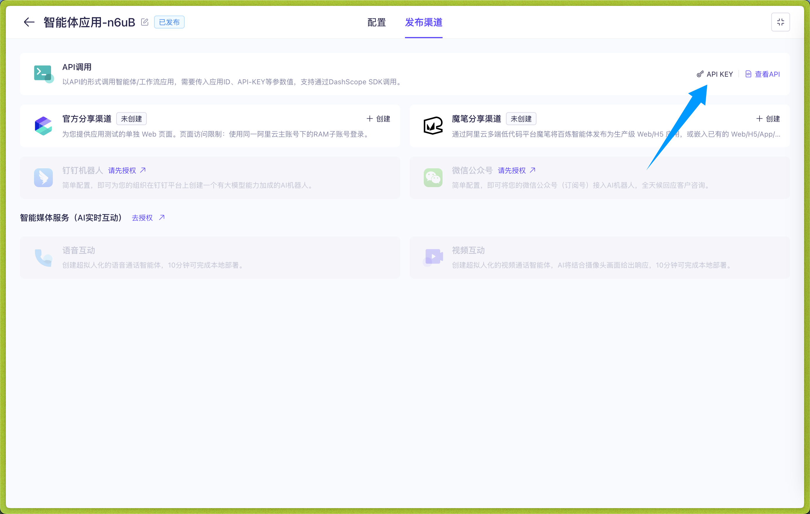
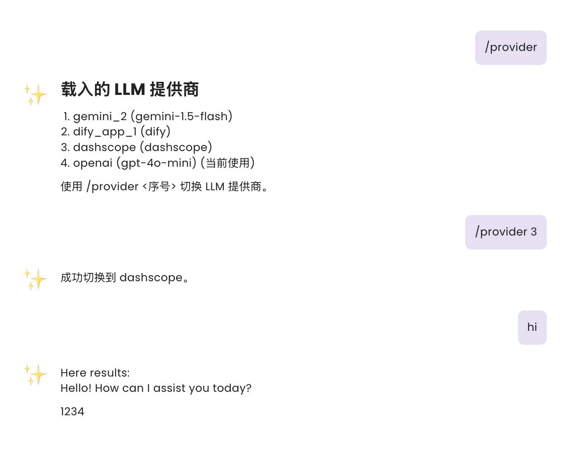
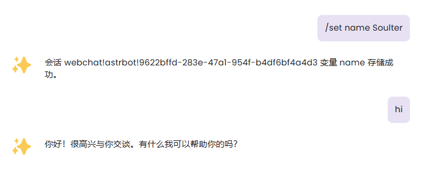

# 接入阿里云百炼应用

在 v3.4.30 及之后，AstrBot 支持接入阿里云百炼应用。

## 使用

在 [阿里云百炼应用](https://bailian.console.aliyun.com/app-center#/app-center) 官网点击新增应用，根据自己的需要创建智能体应用或者工作流应用或者智能体编排应用，并且按照自己的需求构建好智能体或者工作流。

记录应用ID：

点击进入应用，点击发布渠道->API 调用->API KEY，创建并且复制 API KEY：

进入 AstrBot 管理面板->服务提供商->新增服务提供商->Dashscope，进入配置页面。

根据阿里云百炼应用，一共有四种应用类型，分别是

- 智能体应用（agent）
- 任务型工作流应用（task-workflow）
- 对话型工作流应用（dialog-workflow）
- 智能体编排应用（agent-arrange）

> [!TIP]
> 多轮对话仅支持智能体应用和对话型工作流应用。AstrBot 会自动为这两种应用附上对话历史记录以支持多轮对话。

请保证 AstrBot 里配置的 `应用类型` 和阿里云百炼应用里创建的应用类型一致。

然后将应用 ID 填写到 `dashscope_app_id`，API KEY 填写到 `dashscope_api_key`。

填写完这三项之后点击保存。

可以在聊天页进行测试：

## 在聊天时动态设置输入变量

对于两种工作流应用，可在聊天区动态设置输入的变量。

使用 `/set` 指令可以动态设置输入变量，如下图所示：

当设置变量后，AstrBot 会在下次向阿里云百炼应用请求时附上您设置的变量，以灵活适配您的 Workflow。

当然，可以使用 `/unset` 指令来取消您所设置的变量。如 `/unset name`

变量在当前会话永久有效。

> 变量存储在 data/shared_preferences.json 下。