# 接入 TokenPony（小马算力）

[AstrBot](https://astrbot.app/) 是一个开源的一站式 Agent 聊天机器人平台及开发框架。支持将大模型能力接入 QQ、飞书、钉钉、Slack、Telegram、Discord 等多种主流消息平台上，提供开箱即用的 RAG、Agent、MCP 等功能，并拥有丰富的 API 接口，以方便进行二次开发和集成。AstrBot 拥有强大的社区和丰富的插件生态。

TokenPony（小马算力）提供统一的 API，让您可以通过单一端点访问数百个 AI 模型，同时自动处理回退并选择最具成本效益的选项。

## 部署并配置 AstrBot

### 通过 Docker 部署

请确保你的环境上已经安装了 Docker 和 Git。

```bash
git clone https://github.com/AstrBotDevs/AstrBot
cd AstrBot
docker compose up -d
```

> [!TIP]
> 如果您的网络环境在中国大陆境内，上述命令将无法正常拉取。您可能需要修改 compose.yml 文件，将其中的 `image: soulter/astrbot:latest` 替换为 `image: m.daocloud.io/docker.io/soulter/astrbot:latest`。

### 访问 AstrBot WebUI

```txt
http://127.0.0.1:6185
```

默认账户和密码均为 `astrbot`，登录后会提示修改默认密码。

### 配置对话模型

在小马算力 [API Keys](https://www.tokenpony.cn/#/user/keys) 页面创建一个新的 API Key，留存备用。

在小马算力[模型页面](https://www.tokenpony.cn/#/model)选择需要使用的模型，留存模型名称备用。

进入 AstrBot WebUI，点击左栏 `服务提供商` -> `新增提供商` -> 选择 `小马算力` (需要版本 >= 4.3.3)

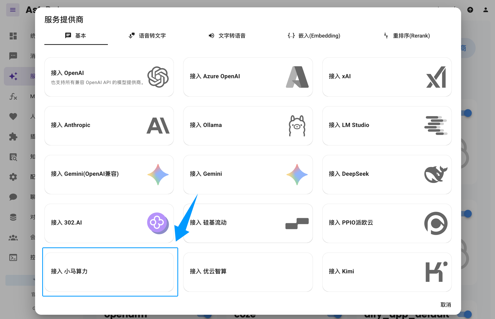

> 如果没有看到 `小马算力` 选项，您也可以直接点击图中的 `接入 OpenAI`，并将 `API Base URL` 修改为 `https://api.tokenpony.cn/v1`。

粘贴上面创建和选择的 `API Key` 和 `模型名称`，点击保存，完成创建。您可以点击下方 `服务提供商可用性` 的 `刷新` 按钮测试配置是否成功。

### 应用对话模型

在 AstrBot WebUI，点击左栏 `配置文件`，找到 AI 配置中的 `默认聊天模型`，选择刚刚创建的 `tokenpony`(小马算力) 提供商，点击保存。

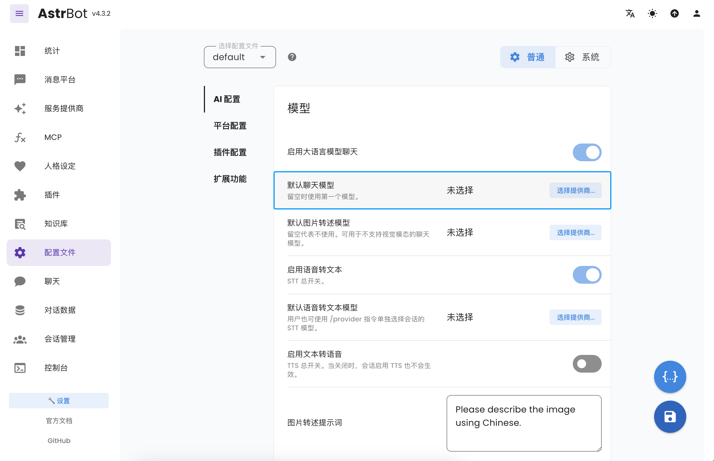

### 在线聊天测试（可选）

您可在 AstrBot WebUI 左栏 `聊天` 页面来测试您配置的模型。

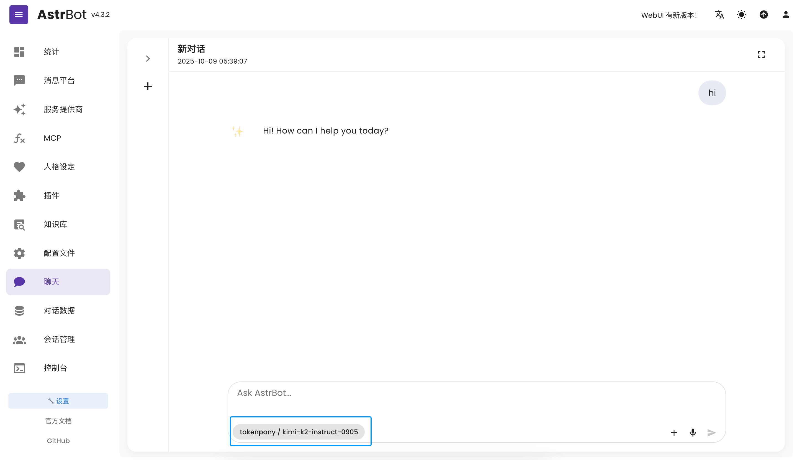

## 接入消息平台（以飞书为例）

此处以飞书为例。您可前往 [AstrBot 文档](https://docs.astrbot.app/) -> `部署` -> `部署消息平台` 查看其他消息平台的接入方式。

### 创建飞书机器人

前往 [开发者后台](https://open.feishu.cn/app) ，创建企业自建应用。

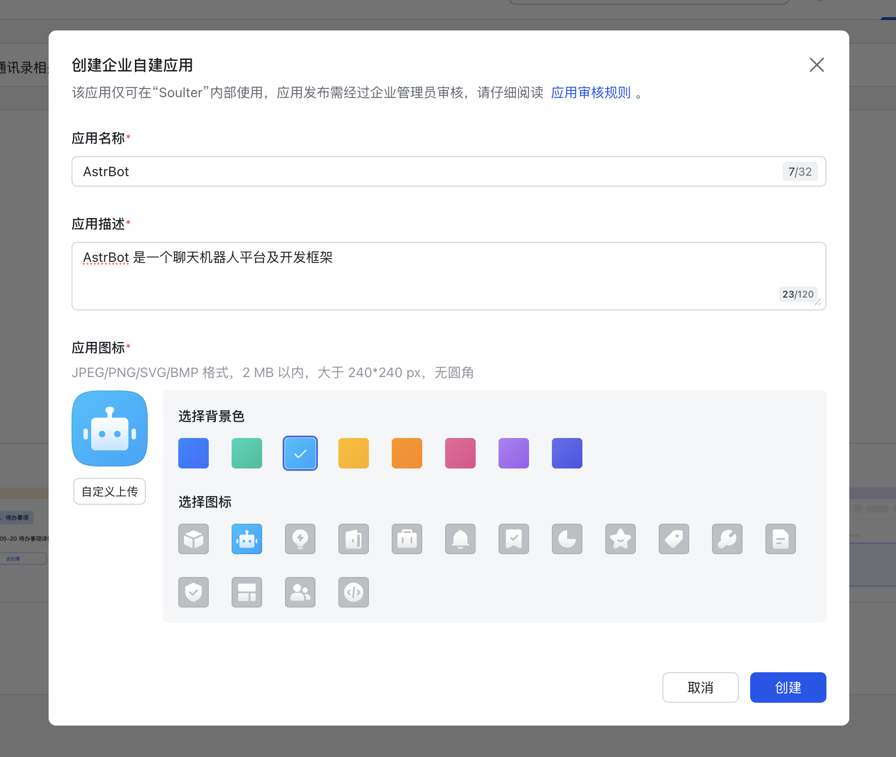

添加应用能力——机器人。

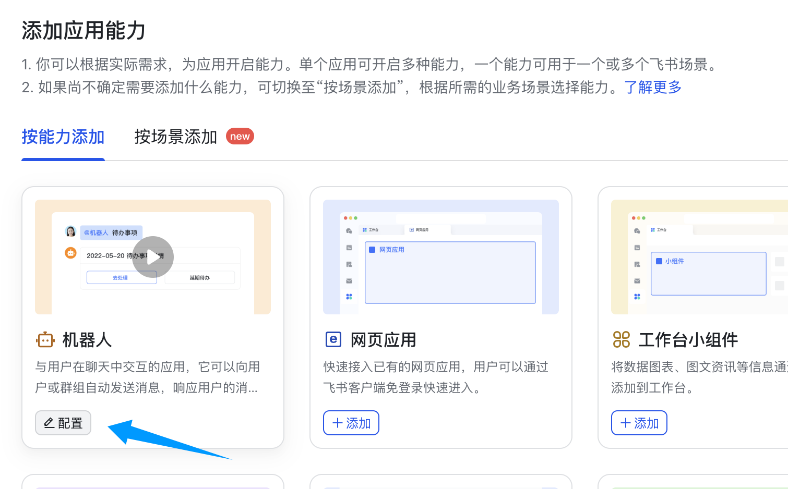

点击凭证与基础信息，获取 app_id 和 app_secret。

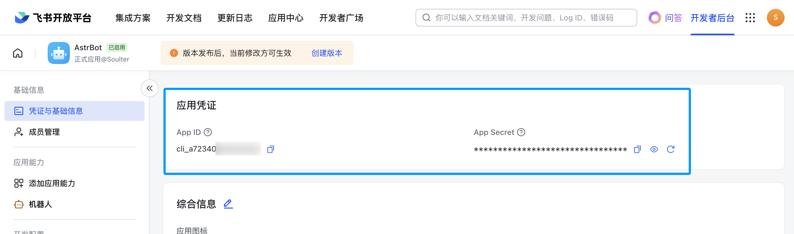

### 配置 AstrBot

1. 进入 AstrBot 的管理面板
2. 点击左边栏 `消息平台`
3. 然后在右边的界面中，点击 `+ 新增适配器`
4. 选择 `lark(飞书)`

弹出的配置项填写：

- ID: 随意填写，用于区分不同的消息平台实例。
- 启用: 勾选。  
- app_id: 获取的 app_id
- app_secret: 获取的 app_secret
- 飞书机器人的名字

如果您正在用国际版飞书，请将 `domain` 设置为 `https://open.larksuite.com`。

点击 `保存`。

### 设置回调和权限

接下来，点击事件与回调，使用长连接接收事件，点击保存。**如果上一步没有成功启动，那么这里将无法保存。**

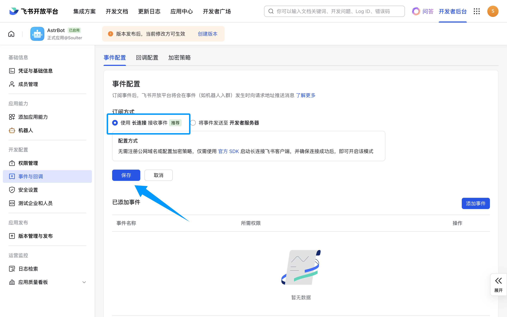

点击添加事件，消息与群组，下拉找到 `接收消息`，添加。

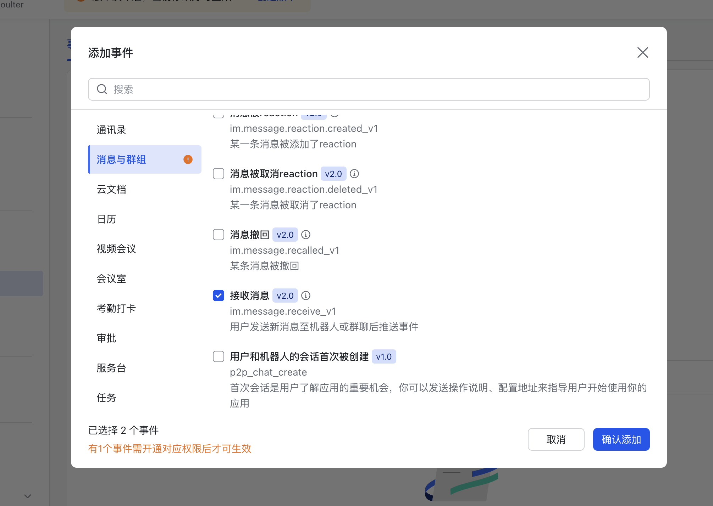

点击开通以下权限。

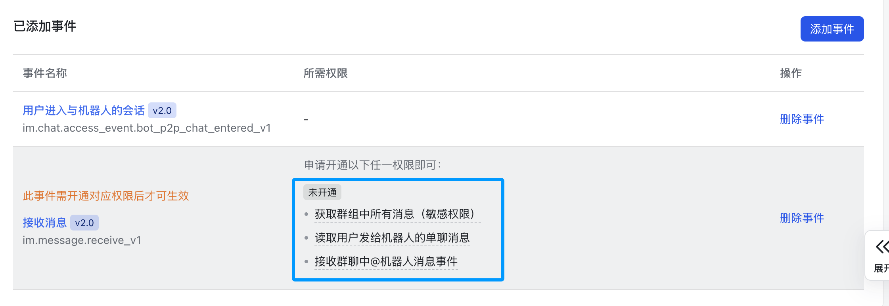

再点击上面的`保存`按钮。

接下来，点击权限管理，点击开通权限，输入 `im:message:send,im:message,im:message:send_as_bot`。添加筛选到的权限。

再次输入 `im:resource:upload,im:resource` 开通上传图片相关的权限。

最终开通的权限如下图：

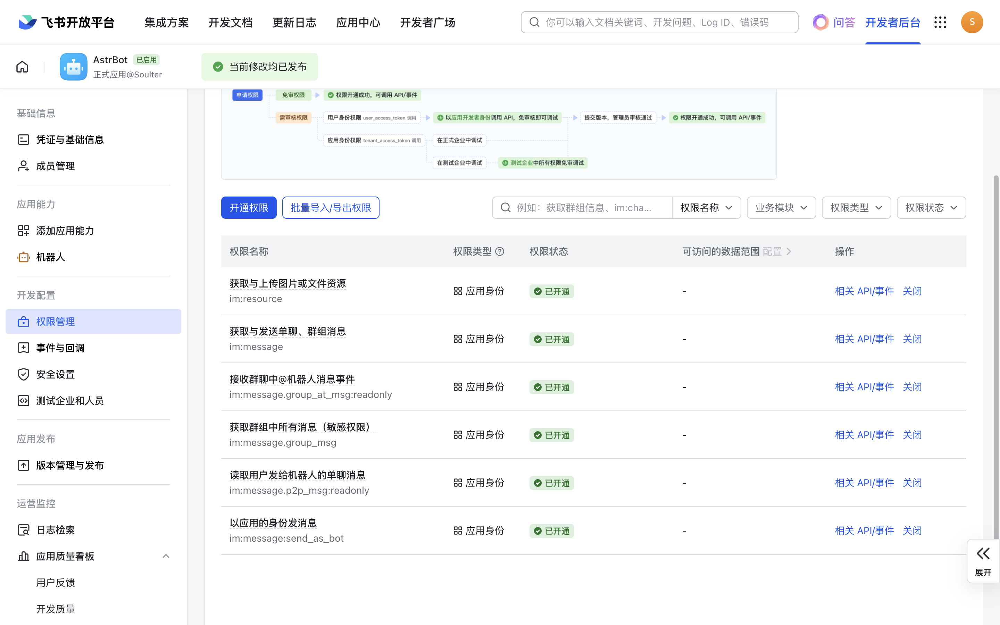

### 创建版本

创建版本。

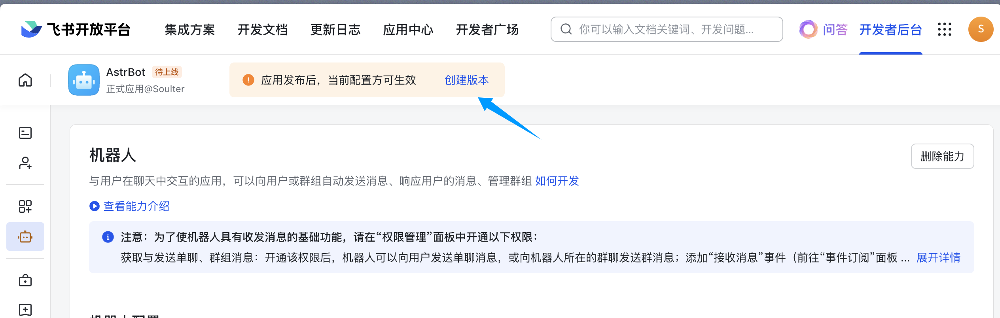

填写版本号，更新说明，可见范围后点击保存，确认发布。

### 拉入机器人到群组

进入飞书 APP（网页版飞书无法添加机器人），点进群聊，点击右上角按钮->群机器人->添加机器人。

搜索刚刚创建的机器人的名字。比如教程创建了 `AstrBot` 机器人：

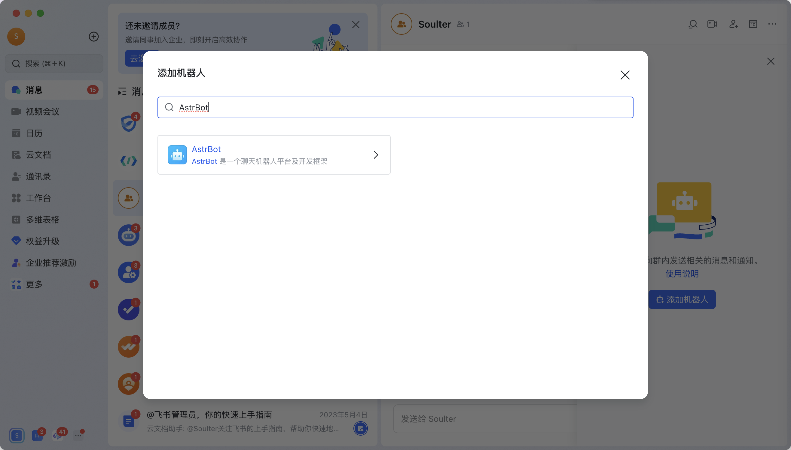

### 🎉 大功告成

在群内发送一个 `/help` 指令，机器人将做出响应。

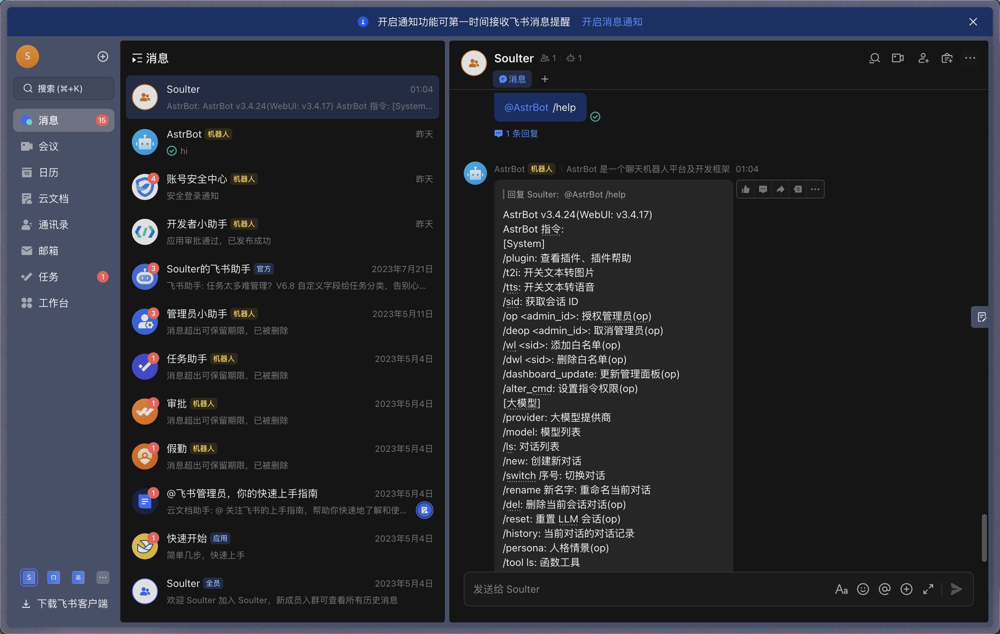

## 更多功能

您可以前往 [AstrBot 文档](https://docs.astrbot.app/) 查看更多功能和配置。
