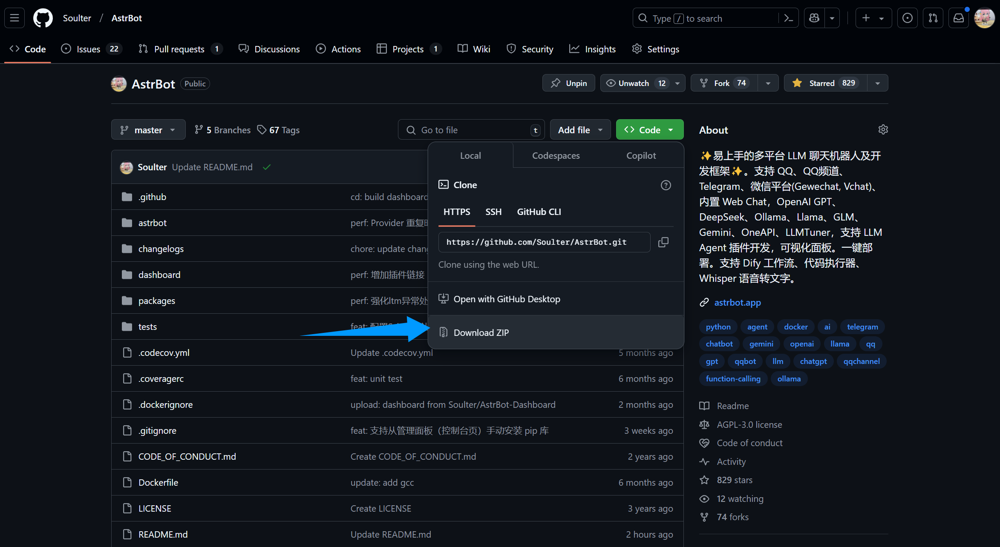
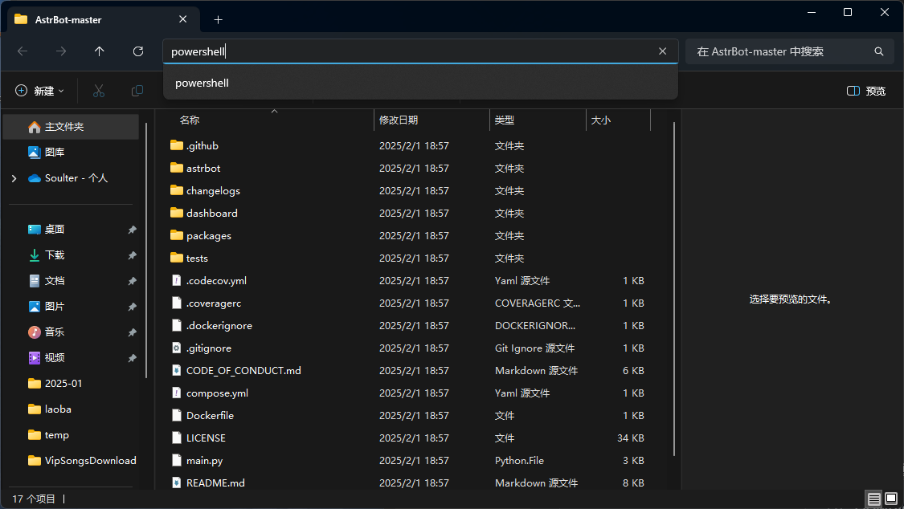

# 通过源码部署 AstrBot

> [!WARNING]
> 你正在直接通过源码来部署本项目，该教程需要您具有一定的技术基础。
>
> 以下教程默认您的设备上已经安装 Python，并且版本 `>=3.10`


## 下载源码

如果你的电脑上安装了 `git`，你可以通过以下命令来下载源码：

```bash
git clone http://github.com/Soulter/AstrBot
cd AstrBot
```

如果你没有安装 `git`，请先下载安装。

或者，直接从 GitHub 上下载源码解压：



## 运行源码

在 AstrBot 源码目录下，使用终端运行以下命令：

> 如果是 Windows，直接下载源码解压的，请打开解压的文件夹，在地址栏输入：
> 

```bash
python3 -m venv ./venv
```

> 也可能是 `python` 而不是 `python3`
 
以上步骤会创建一个虚拟环境并激活（以免打乱你电脑本地的 Python 环境），并使用清华大学的镜像源来安装 AstrBot 的依赖。依赖的安装需要花费一些时间。

接下来，通过以下命令安装依赖文件：

Mac/Linux/WSL 执行：

```bash
source venv/bin/activate
python -m pip install -r requirements.txt -i https://mirrors.tuna.tsinghua.edu.cn/pypi/web/simple
python main.py
```

> [!TIP]
> AstrBot 支持基于 Docker 的沙箱代码执行器。如果你需要使用沙箱代码执行器，请使用 `sudo` 以便 AstrBot 能够正常操作 Docker。
> ```bash
> sudo -E venv/bin/python3 main.py
> ```


Windows 执行:

```bash
venv\Scripts\activate
python -m pip install -r requirements.txt -i https://mirrors.tuna.tsinghua.edu.cn/pypi/web/simple
python main.py
```


## 🎉 大功告成！

如果一切顺利，你会看到 AstrBot 打印出的日志。

如果没有报错，你会看到一条日志显示类似 `🌈 管理面板已启动，可访问` 并附带了几条链接。打开其中一个链接即可访问 AstrBot 管理面板。链接是 `http://localhost:6185`。

> [!TIP]
> 如果你正在服务器上部署 AstrBot，需要将 `localhost` 替换为你的服务器 IP 地址。
>
> 默认用户名和密码是 `astrbot` 和 `astrbot`。


接下来，你需要部署任何一个消息平台，才能够实现在消息平台上使用 AstrBot。
