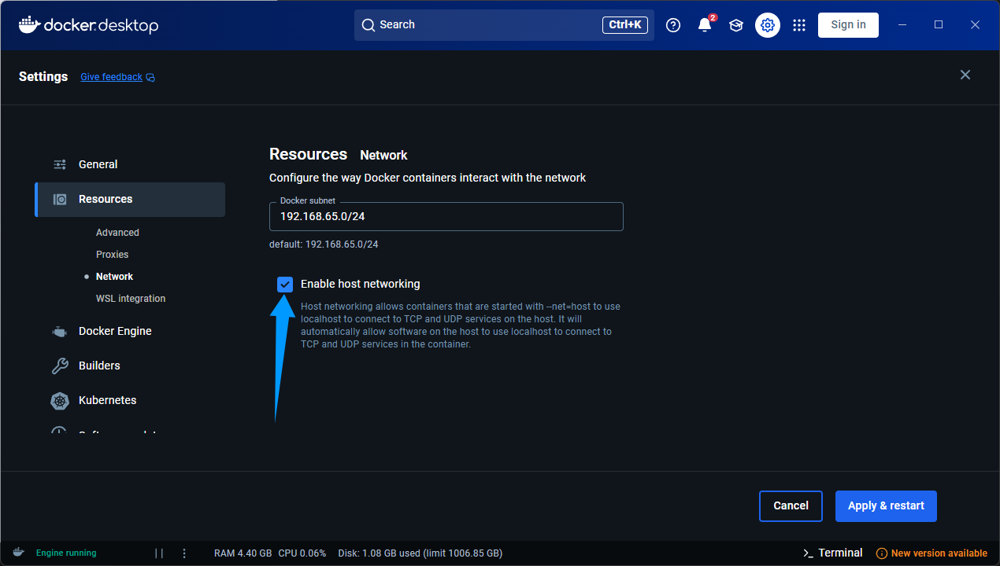
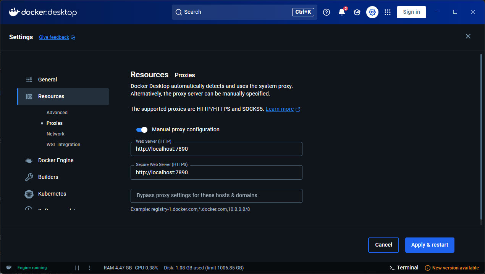
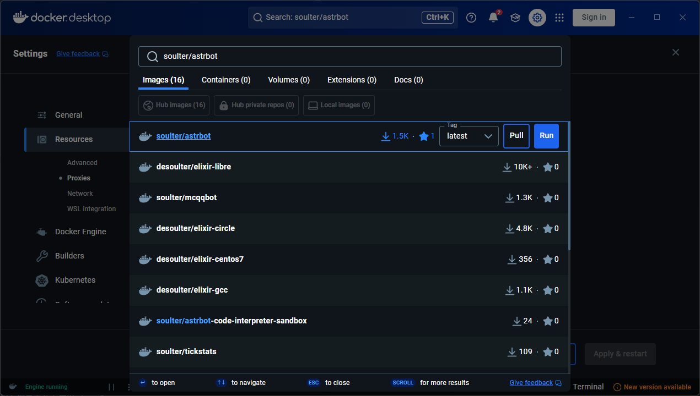
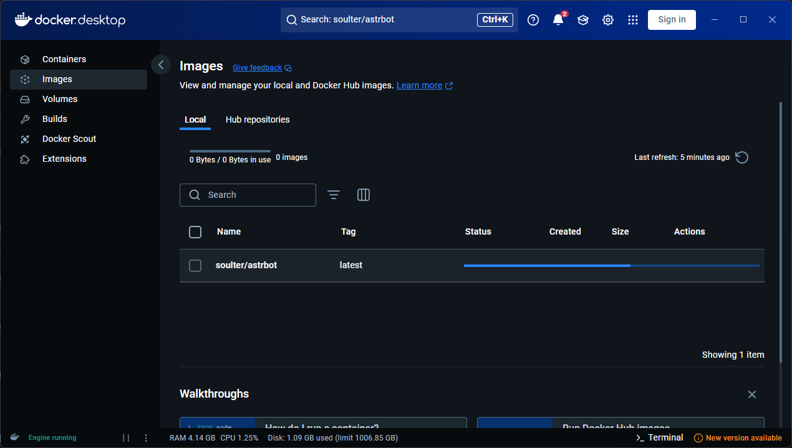
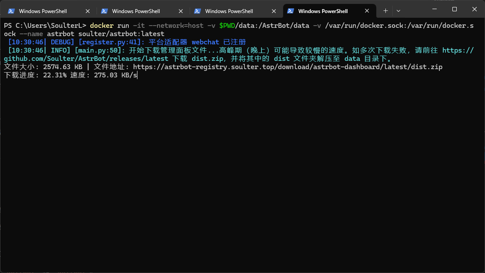

# 使用 Docker 部署 AstrBot

> [!WARNING]
> 通过 Docker 可以方便地将 AstrBot 部署到 Windows, Mac, Linux 上。
> 
> 以下教程默认您的环境已安装 Docker。如果没有安装，请参考 [Docker 官方文档](https://docs.docker.com/get-docker/) 进行安装。

> 如果网络环境在国内，可能无法正常拉取 Docker 镜像，请挂代理（需要额外在 Docker 设置中配置），或者使用国内镜像源。
> 镜像源可参考：[目前国内可用Docker镜像源汇总（截至2025年1月）](https://www.coderjia.cn/archives/dba3f94c-a021-468a-8ac6-e840f85867ea)
> 如果仍不会配置，请加群询问~


## 通过 Docker Compose 部署


首先，需要 Clone AstrBot 仓库到本地：

```bash
git clone https://github.com/Soulter/AstrBot
cd AstrBot
```

然后，运行 Compose：

```bash
sudo docker compose up -d
```

> Windows 下不需要加 sudo，下同

## 通过 Docker 部署

```bash
mkdir astrbot
sudo docker run -itd --network=host -v $PWD/data:/AstrBot/data --name astrbot soulter/astrbot:latest
```

> Windows 下不需要加 sudo，下同

通过以下命令查看 AstrBot 的日志：

```bash
sudo docker logs -f astrbot
```

> [!TIP]
> AstrBot 支持基于 Docker 的沙箱代码执行器。如果你需要使用沙箱代码执行器，请额外添加 `-v /var/run/docker.sock:/var/run/docker.sock` 参数。即:
> ```bash
> sudo docker run -itd --network=host -v $PWD/data:/AstrBot/data -v /var/run/docker.sock:/var/run/docker.sock --name astrbot soulter/astrbot:latest
> ```

## Windows Docker Desktop 部署

首先下载 Docker Desktop（Windows、带 GUI 的Linux、MacOS 都可以）。

启用 host networking



国内用户需要配置代理，下面填代理软件的代理地址，clash 默认是 7890，v2rayN 默认是 10809：



搜索 soulter/astrbot 然后点击 Pull：



等待下载：



由于可视化运行容器无法设置网络模式，接下来请通过命令行运行容器。Windows 请在 powershell 中运行上面方法的代码。MacOS 和Linux请在终端中运行。

```bash
docker run -itd --network=host -v $PWD/data:/AstrBot/data --name astrbot soulter/astrbot:latest
```




## 🎉 大功告成！

如果一切顺利，你会看到 AstrBot 打印出的日志。

如果没有报错，你会看到一条日志显示类似 `🌈 管理面板已启动，可访问` 并附带了几条链接。打开其中一个链接即可访问 AstrBot 管理面板。

> [!TIP]
> 由于 Docker 隔离了网络环境，所以不能使用 `localhost` 访问管理面板。
>
> 默认用户名和密码是 `astrbot` 和 `astrbot`。


接下来，你需要部署任何一个消息平台，才能够实现在消息平台上使用 AstrBot。