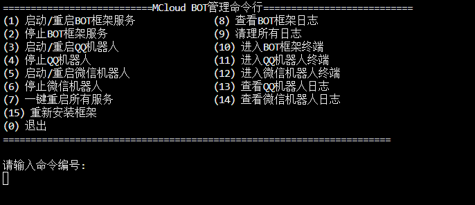

# 通过 Linux 一键脚本安装

> [!WARNING]
> 1. 该脚本由社区 **@小馒头** 提供（感谢❤）。
> 2. AstrBot 团队不保证该脚本的可用性，并且不参与该脚本的维护工作。我们推荐 Linux 用户手动部署或者通过 Docker 部署 AstrBot。



## 使用

在终端执行

CentOS安装脚本：

```bash
bash <(curl -sSL https://gitee.com/mc_cloud/mccloud_bot/raw/master/mccloud_install.sh)
```

Ubuntu安装脚本：

```bash
wget -O - https://gitee.com/mc_cloud/mccloud_bot/raw/master/mccloud_install_u.sh | bash
```

支持 QQ 一键管理。命令：bot


## 备注

@小馒头: 免费试用：https://idc.stay33.cn/free.html
云电脑挂机宝新人只需要0元/月 后面续费只需要3.33元 4核4G
购买优惠码：MCCloud_BOT