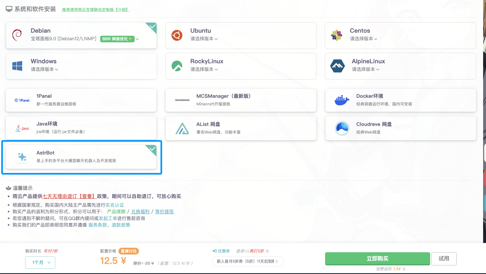

# 通过 雨云 一键部署

[雨云](https://www.rainyun.com/about)成立于 2018 年，是具有自主知识产权的国产云计算服务提供商，具有可靠的营业资质和实体办公场所。

AstrBot 已经上架至雨云的预装软件列表，支持**一键安装** AstrBot 并提供高性能的云计算资源，保证 `AstrBot` 24 小时在线。

## 部署服务器

在这一步，你需要选购一个云服务器，最低价格为 `9` 元/月，当然，你也可以选购更高配置的服务器。

> [!NOTE]
> 由于 `gewechat` 运行时占用资源较多，如果您希望在服务器上同时部署 `gewechat`，所选的服务器配置内存需要 >= `4096 MB`，否则可能会出现内存不足的情况。

1. 打开 [雨云官网](https://www.rainyun.com/NjU1ODg0_)。
2. 根据你的喜好和预算，选择一个合适的服务器配置。
    - 😉 如果您的预算不是很充足，可以选择：`江苏宿迁` - `Xeon® Gold (金牌)` - `KVM 入门版`/`KVM 标配版` 配置组合。这个配置组合的价格分别为 `9` 元/月 和 `12.5` 元/月，适合个人用户使用。
    - 🥰 如果您希望更支持和长期使用本开源项目，可以选购更高配置和更长时长的服务器。（所有的推广费用将 **只用于** AstrBot 目前使用的雨云服务器的开销，约 `1400` 元 / 年）
3. 在下面的 `系统和软件安装` 一节，选中 `AstrBot`，然后点击 `立即购买`。
4. 如果您的余额不足，将会跳转至充值页面。充值完成后再返回点击 `立即购买` 即可。

接下来，雨云会自动帮您安装好系统和 `AstrBot` 软件。

如果有疑问，请：

1. 点击雨云官网右下角 `咨询` 提交工单
2. 点击雨云官网上方 `交流社区` 添加雨云 QQ 群。
