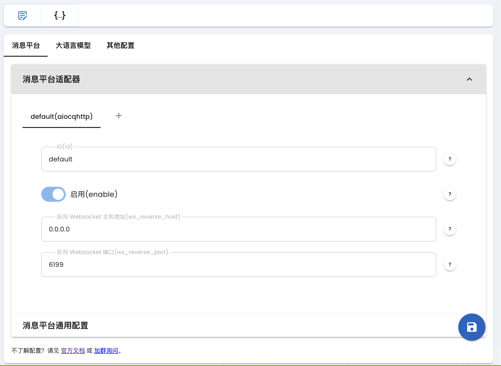

# 接入 Lagrange

> [!TIP]
> 最新的部署方式请以 [Lagrange Doc](https://lagrangedev.github.io/Lagrange.Doc/Lagrange.OneBot/Config/#%E4%B8%8B%E8%BD%BD%E5%AE%89%E8%A3%85) 为准。

## 下载

从 [GitHub Release](https://github.com/LagrangeDev/Lagrange.Core/releases) 下载最新版的 `Lagrange.OneBot`。

对于 Windows 设备，请下载 `Lagrange.OneBot_win-x64_xxxx` 压缩包。

对于 X86 的 Linux 用户，下载 `Lagrange.OneBot_linux-x64_xxx` 压缩包。

对于 Arm 的 Linux 用户，下载 `Lagrange.OneBot_linux-arm64_xxx` 压缩包。

对于 M 芯片 Mac 用户，下载 `Lagrange.OneBot_osx-arm64_xxx` 压缩包。

对于 Intel 芯片 Mac 用户，下载 `Lagrange.OneBot_osx-x64_xxx` 压缩包。

## 部署

请参阅 [Lagrange Doc](https://lagrangedev.github.io/Lagrange.Doc/Lagrange.OneBot/Config/#%E8%BF%90%E8%A1%8C)。

运行完成后，请修改 [配置文件](https://lagrangedev.github.io/Lagrange.Doc/Lagrange.OneBot/Config/#%E9%85%8D%E7%BD%AE%E6%96%87%E4%BB%B6)，

在 `Implementations` 字段下添加：

```json
{
    "Type": "ReverseWebSocket",
    "Host": "127.0.0.1",
    "Port": 6199,
    "Suffix": "/ws",
    "ReconnectInterval": 5000,
    "HeartBeatInterval": 5000,
    "AccessToken": ""
}
```

一定要保证 `Suffix` 为 `/ws`。


## 连接到 AstrBot

### 配置 aiocqhttp

在 AstrBot 的管理面板中，选择左边栏的 `配置`，然后在右边的界面中，点击 `消息平台` 选项卡。点击 `+` 号，选择 `aiocqhttp`，会出现 `aiocqhttp` 的相关配置项，如下图所示：



配置项填写：

- ID(id)：随意填写，用于区分不同的消息平台实例。系统会自动填充。
- 启用(enable): 勾选。
- 反向 WebSocket 主机地址：请填写你的机器的 IP 地址。如 `0.0.0.0`
- 反向 WebSocket 端口：填写上面配置出来的 `Port` 端口，例如 `6199`。
