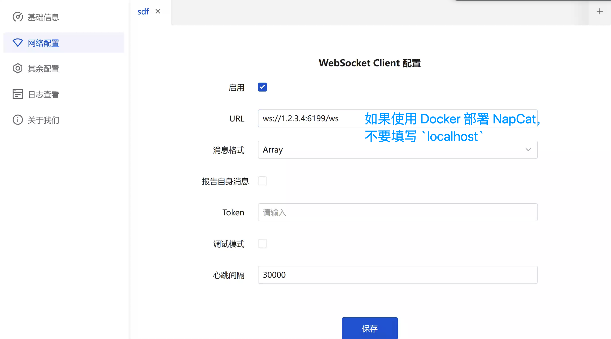

# 通过 NapCatQQ 协议实现端接入 QQ

> [!TIP]
> 如果过于频繁使用（同一时间发送消息次数过多），可能会导致更高的风控风险，请注意使用频率。

NapCatQQ 是基于无头 QQNT 的 OneBot 协议实现端。它本质上运行了一个 QQNT 实例。

NapCatQQ 的 GitHub 仓库：[NapCatQQ](https://github.com/NapNeko/NapCatQQ)
NapCatQQ 的文档：[NapCatQQ 文档](https://napcat.napneko.icu/)

> [!WARNING]
> 为了成功部署，你需要：
> - 一个 QQ 号（最好不是新创建的 QQ 号）。
> - 一台具有摄像功能的手机以扫码登录 QQ。

NapCat 提供了大量的部署方式，包括 Docker、Windows 一键安装包等等。

## 通过一键脚本部署

推荐这种方式。

### Windows

看这篇文章：[NapCat.Shell - Win手动启动教程](https://napneko.github.io/guide/boot/Shell#napcat-shell-win%E6%89%8B%E5%8A%A8%E5%90%AF%E5%8A%A8%E6%95%99%E7%A8%8B)

### Linux

看这篇文章：[NapCat.Installer - Linux一键使用脚本(支持Ubuntu 20+/Debian 10+/Centos9)](https://napneko.github.io/guide/boot/Shell#napcat-installer-linux%E4%B8%80%E9%94%AE%E4%BD%BF%E7%94%A8%E8%84%9A%E6%9C%AC-%E6%94%AF%E6%8C%81ubuntu-20-debian-10-centos9)


> [!TIP]
> **Napcat WebUI 在哪打开**：
> 在 napcat 的日志里会显示 WebUI 链接。
> 
> 如果是 linux 命令行一键部署的napcat：`docker log <qq号>`。
> 
> Docker部署的 NapCat：`docker logs napcat`。

## 通过 Docker 部署

> [!TIP]
> 如果用 Docker 部署，将无法正常接收到`语音数据`、`文件数据`。这意味着语音转文字、沙箱的文件输入功能将无法使用。可以接收到文字消息、图片消息等其他类型的消息。

默认您安装了 Docker。

在终端执行以下命令即可一键部署。

```bash
docker run -d \
-e NAPCAT_GID=$(id -g) \
-e NAPCAT_UID=$(id -u) \
-p 3000:3000 \
-p 3001:3001 \
-p 6099:6099 \
--name napcat \
--restart=always \
mlikiowa/napcat-docker:latest
```

执行成功后，需要查看日志以得到登录二维码和管理面板的 URL。

```bash
docker logs napcat
```

请复制管理面板的 URL，然后在浏览器中打开备用。

然后使用你要登录的 QQ 扫描出现的二维码，即可登录。

如果登录阶段没有出现问题，即成功部署。

## 连接到 AstrBot

### 配置 aiocqhttp

在 AstrBot 的管理面板中，选择左边栏的 `配置`，然后在右边的界面中，点击 `消息平台` 选项卡。点击 `+` 号，选择 `aiocqhttp`，会出现 `aiocqhttp` 的相关配置项，如下图所示：


配置项填写：

- ID(id)：随意填写，用于区分不同的消息平台实例。系统会自动填充。
- 启用(enable): 勾选。
- 反向 WebSocket 主机地址：请填写你的机器的 IP 地址。一般情况下请直接填写 `0.0.0.0`
- 反向 WebSocket 端口：填写一个端口，例如 `6199`。

### 配置管理员

填写完毕后，点击 `其他配置` 选项卡，找到 `管理员 ID`，填写你的 QQ 号（不是机器人的 QQ 号）。

### 保存配置

切记点击右下角 `保存`，AstrBot 重启并会应用配置。

### 在 NapCatQQ 中添加 WebSocket 客户端

切换回 NapCatQQ 的管理面板，点击 `网络配置->添加网络配置`，在弹出的窗口中，名称随意填写，类型选择 `WebSocket 客户端`。点击确认。



在新弹出的窗口中：

- 勾选 `启用`。
- `URL` 填写 `ws://<宿主机IP>:<在 AstrBot中填写的端口>/ws`。如 `ws://1.2.3.4:6199/ws`。
- 消息格式：`Array`

> 切记后面加一个 `/ws`!
> 切记后面加一个 `/ws`!
> 切记后面加一个 `/ws`!

点击 `保存`。

## 🎉 大功告成！

此时，你的 AstrBot 和 NapCatQQ 应该已经连接成功。使用 `私聊` 的方式在 QQ 对机器人发送 `/help` 以检查是否连接成功。