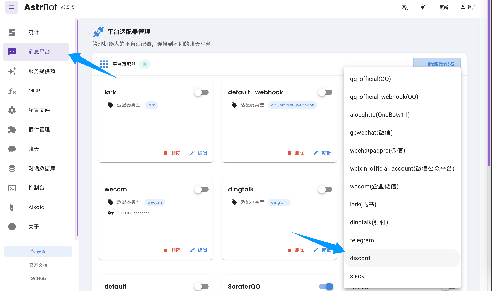
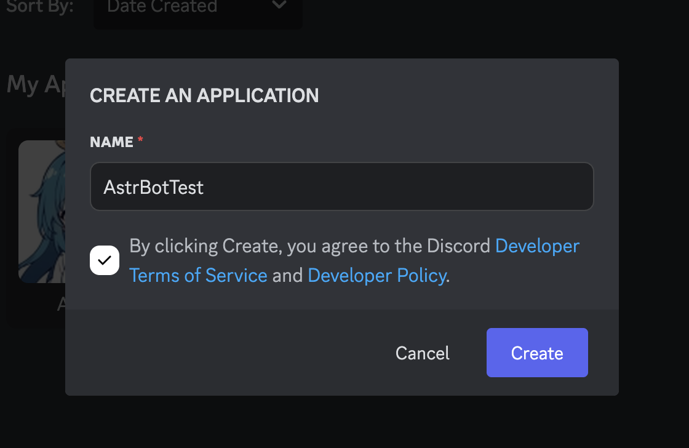

# 接入 Slack

AstrBot v3.5.16 及之后，支持接入 [Discord](https://discord.com/) 消息平台。

## 创建 AstrBot Discord 平台适配器

进入消息平台，点击新增适配器，找到 Discord 并点击进入 Discord 配置页。

在弹出的配置对话框中点击 `启用`。

## 在 Discord 创建 App

1. 前往 [Discord](https://discord.com/developers/applications)，点击右上角蓝色按钮，输入应用名字，创建应用。

2. 点击左边栏的 Bot，点击 Reset Token 按钮，创建好 Token 后，点击 Copy 按钮，将 Token 填入配置中的 Discord Bot Token 处。
3. 点击左边栏的 OAuth2，在 OAuth2 URL Generator 中选中 `Bot`，然后在下方出现的 Bot Permissions 处选择允许的权限。一般来说，建议添加如下权限：
    - Send Messages
    - Create Public Threads
    - Create Private Threads
    - Send TTS Messages
    - Manage Messages
    - Manage Threads
    - Embed Links
    - Attach Files
    - Read Message History
    - Add Reactions
4. 复制下方出现的 GENERATED URL。打开这个 URL，将 Bot 添加到所需要的服务器。
5. 返回 AstrBot，在填好 Discord Bot Token 后，点击保存。
6. 进入 Discord 服务器，@ 刚刚创建的机器人（也可以不 @），输入 `/help`，如果成功返回，则测试成功。

如果有疑问，请[提交 Issue](https://github.com/AstrBotDevs/AstrBot/issues)。