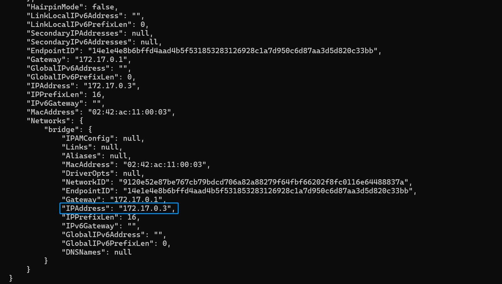

# 通过 Gewechat 接入微信

> [!NOTE]
>
> 1. 这个接入方式不受微信官方支持，使用的是 [Devo919/Gewechat](https://github.com/Devo919/Gewechat)。请注意风险。如果要使用官方支持的方式，> 请使用企业微信的方式接入。
> 
> 2. 请控制聊天频率。如果过于频繁使用（同一时间发送消息次数过多），可能会导致更高的风控风险，请注意使用频率。


> [!WARNING]
> 1. 仅支持微信个人号
> 2. 微信限制，需要手动扫码登录
> 3. 微信限制一个微信号必须**有一台手机在线**才能登录其他端。而 Gewechat 是一个 IPAD 微信客户端。因此，你需要有一台手机登录该微信，才能使用 Gewechat。

## 部署 Gewechat

Gewechat 只能使用 Docker 部署，如果您没有安装 Docker，请自行安装。Windows/Mac 用户请安装 `Docker Desktop`，Linux 用户请安装 `Docker`。

最新信息请参考 [Gewechat 仓库](https://github.com/Devo919/Gewechat?tab=readme-ov-file) 部署 Gewechat。

### 拉取 Gewechat 镜像

```bash
docker pull registry.cn-hangzhou.aliyuncs.com/gewe/gewe:latest
docker tag registry.cn-hangzhou.aliyuncs.com/gewe/gewe gewe
```

### 运行 Gewechat 容器

```bash
mkdir gewechat
docker run -itd -v ./gewechat:/root/temp -p 2531:2531 -p 2532:2532 --privileged=true --name=gewe gewe /usr/sbin/init
```

如果需要开机自启，可以：

```bash
docker update --restart=always gewe
```

可以通过日志查看启动情况：

```bash
docker logs gewe -f
```

- 启动可能会花费较长时间，大概在 10-30 秒。
- 如果出现 `[!!!!!!] Failed to allocate manager object, freezing.`，请参考 [AstrBot#340](https://github.com/AstrBotDevs/AstrBot/issues/340)

启动好后，可以通过浏览器访问 `http://localhost:2531` 查看是否正常启动。

## 在 AstrBot 中配置 Gewechat 适配器

1. 进入 AstrBot 的管理面板
2. 点击左边栏 `消息平台`
3. 然后在右边的界面中，点击 `+ 新增适配器` 
4. 选择 `gewechat`

弹出的配置项填写：

- `ID(id)`：随意填写，用于区分不同的消息平台实例。
- `启用(enable)`: 勾选。
- `nickname` 请随便填一个具有辨识度的英文名,不需要是微信用户名。
- `base_url` 是连接到 Gewechat 后端的 API 地址。
- `host` 为回调地址主机，即 gewechat 下发事件到 AstrBot 的地址。**请填写宿主机局域网地址(windows 用 ipconfig 看，linux 用 ip -a 看) 或者服务器公网地址（如果在用服务器）**
- `port` 为回调地址端口，可不修改。

> [!NOTE]
> 对于 Mac/Windows 使用 Docker Desktop 部署 AstrBot 部署的用户，base_url 请填写为 `http://host.docker.internal:2531`。并且回调地址端口不要修改。如果还不行，请通过 `docker inspect gewe` 查看 gewechat 容器网络的 IP 地址，然后 `http://ip地址:2531`。
> 
> 对于 Linux 使用 Docker 部署 AstrBot 部署的用户，请通过 `docker inspect gewe` 查看 gewechat 容器网络的 IP 地址，然后 `http://ip地址:2531`。如果有公网ip，也可填写公网 ip，需要在系统和服务器云厂商安全组(如有)放行 2531 端口。
> 
> 对于 host，如果使用 Docker Desktop 部署 AstrBot 部署的用户，请填写为 `host.docker.internal`。如果使用 Linux 使用 Docker 部署 AstrBot 部署的用户，请通过 `docker inspect astrbot` 查看 astrbot 容器网络的 IP 地址，然后填进去。
>
> docker inspert:
>
> 

点击 `保存`。

- 如果出现报错 "Cannot Connect to xxxxxx:2531"，请使用 `docker logs gewe` 查看 Gewechat 的日志，是否正常启动。
- 如果出现报错 "创建设备失败......unexpect EOF"，请关闭代理软件后重试。
- 如果出现报错 "设备不存在 / 无法创建设备"，请更换 AstrBot gewechat 配置里的 username 后重试。
- 请确保部署 Gewechat 的机器和手机微信处于同一城市，否则可能需要验证码登录，而 Gewechat 项目目前的验证码登录功能存在异常

## 扫码登录

接下来需要查看日志。请在管理面板的 `控制台` 查看或者切终端查看。

查看 AstrBot 的终端日志输出，会出现相关引导提示。打开提示的二维码链接扫码登录即可。


## 设置白名单

由于微信的 ID 是一段非常长的随机字符串，因此没办法通过默认设置 AstrBot 管理员的方式来设置初始会话。操作步骤如下：

1. 给机器人号随便发一条消息，在终端中会出现 `会话 xxx 不在会话白名单中，已终止事件传播。` 的日志（日志等级为 `INFO`）。
2. 复制 `xxx` 的值。
3. 在管理面板 `配置->消息平台->消息平台通用配置` 中找到 `ID 白名单`，粘贴 `xxx` 的值，回车填入。
4. 点击 `保存`，等待 AstrBot 重启。
5. 尝试发送 `/help` 命令，看是否有响应。

## 注意事项

一旦登录成功，请牢记在配置时配置的 username，如果更换，则相当于使用新设备登录。频繁新设备登录容易触发风控。

## 常见问题

1. Cannot connect to host xxxx:2531。请通过 `docker logs gewe` 检查 Gewechat 容器是否正常运行。
2. host 回调地址异常。请参考 https://github.com/AstrBotDevs/AstrBot/issues/327
3. 创建设备失败。请重启 gewe 容器几次再看情况。如果还不行就等一段时间之后再尝试。
4. 设备 id 不存在。请修改 AstrBot 配置，将 gewechat 的配置中的 username 随便改一个名字后保存重启。
