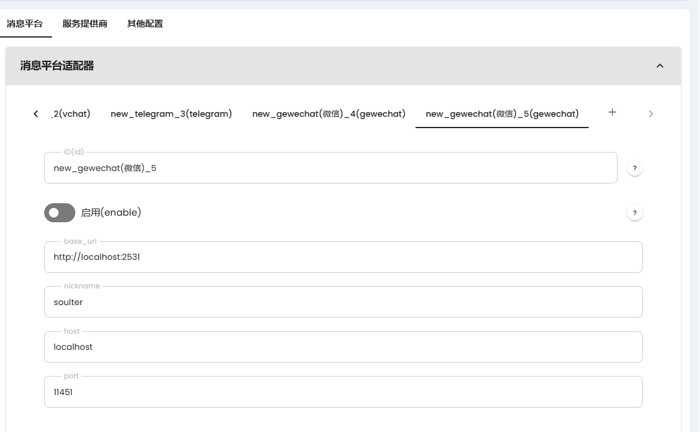

# 通过 Gewechat 接入微信

> [!NOTE]
> 请控制聊天频率。如果过于频繁使用（同一时间发送消息次数过多），可能会导致更高的风控风险，请注意使用频率。

> [!WARNING]
> 1. 仅支持微信个人号
> 2. 微信限制，需要手动扫码登录
> 3. 微信限制一个微信号必须**有一台手机在线**才能登录其他端。而 Gewechat 是一个 IPAD 微信客户端。因此，你需要有一台手机登录该微信，才能使用 Gewechat。

## 部署 Gewechat

Gewechat 需要使用 Docker 部署。请参考 [启动 Gewechat](https://github.com/Devo919/Gewechat?tab=readme-ov-file#%E5%90%AF%E5%8A%A8%E6%9C%8D%E5%8A%A1) 部署 Gewechat。

## 在 AstrBot 中配置 Gewechat 适配器

在 AstrBot 的管理面板中，选择左边栏的 `配置`，然后在右边的界面中，点击 `消息平台` 选项卡。点击 `+` 号，选择 `vchat`，会出现 `vchat` 的相关配置项，如下图所示：

- `nickname` 请随便填一个具有辨识度的英文名。
- `base_url` 是连接到 Gewechat 后端的 API 地址。如果你将 Gewechat 部署到了其他服务器或设备，请自行修改 `localhost` 为服务器地址。
- `host` 为回调地址主机，即 gewechat 下发事件到 AstrBot 的地址。
- `port` 为回调地址端口，可不修改。

勾选 `启用`，然后点击 `保存`。

## 扫码登录

接下来需要查看日志。请在管理面板的控制台查看或者切终端查看。

查看 AstrBot 的终端日志输出，会出现相关引导提示。打开提示的二维码链接扫码登录即可。

## 设置白名单

由于微信的 ID 是一段非常长的随机字符串，因此没办法通过默认设置 AstrBot 管理员的方式来设置初始会话。操作步骤如下：

1. 给机器人号随便发一条消息，在终端中会出现 `会话 xxx 不在会话白名单中，已终止事件传播。` 的日志（日志等级为 `INFO`）。
2. 复制 `xxx` 的值。
3. 在管理面板 `配置->消息平台->消息平台通用配置` 中找到 `ID 白名单`，粘贴 `xxx` 的值，回车填入。
4. 点击 `保存`，等待 AstrBot 重启。
5. 尝试发送 `/help` 命令，看是否有响应。

## 注意事项

一旦登录成功，请牢记在配置时配置的 username，如果更换，则相当于使用新设备登录。频繁新设备登录容易触发风控。