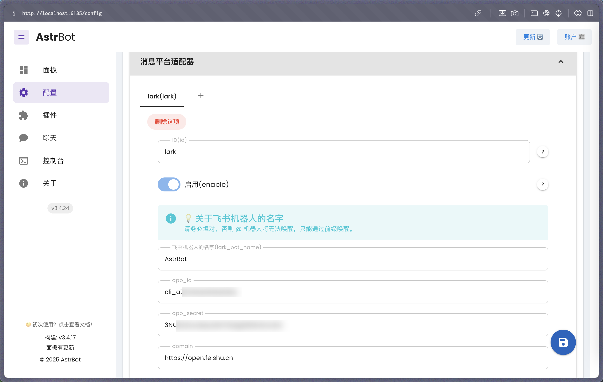

# 接入飞书

## 创建机器人

前往 [开发者后台](https://open.feishu.cn/app) ，创建企业自建应用。

添加应用能力——机器人。

点击凭证与基础信息，获取 app_id 和 app_secret。

## 配置 AstrBot

打开 AstrBot 管理面板->配置页->消息平台适配器->+，创建一个飞书（Lark）适配器。

将刚刚复制的 app_id 和 app_secret 填入。以及飞书机器人的名字。

如果您正在用国际版飞书，请将 `domain` 设置为 `https://open.larksuite.com`。

然后点击右下角保存配置，等待重启成功。

## 设置回调和权限

点击事件与回调，使用长连接接收事件，点击保存。**如果上一步没有成功启动，那么这里将无法保存。**

点击添加事件，消息与群组，下拉找到 `接收消息`，添加。

点击开通以下权限。

再点击上面的`保存`按钮。

接下来，点击权限管理，点击开通权限，输入 `im:message:send,im:message,im:message:send_as_bot`。添加筛选到的权限。

再次输入 `im:resource:upload,im:resource` 开通上传图片相关的权限。

最终开通的权限如下图：

## 创建版本

创建版本。

填写版本号，更新说明，可见范围后点击保存，确认发布。

## 拉入机器人到群组

进入飞书 APP（网页版飞书无法添加机器人），点进群聊，点击右上角按钮->群机器人->添加机器人。

搜索刚刚创建的机器人的名字。比如教程创建了 `AstrBot` 机器人：

## 🎉 大功告成

在群内发送一个 `/help` 指令，机器人将做出响应。

