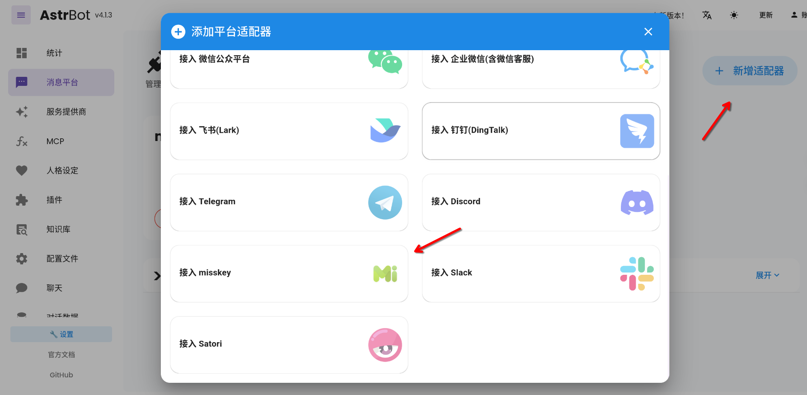
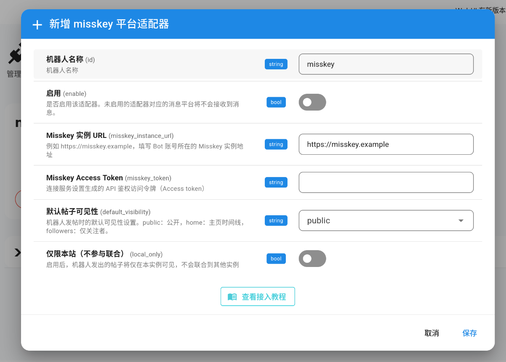
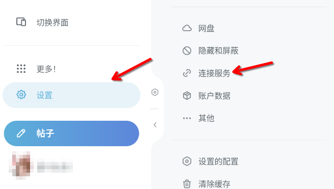
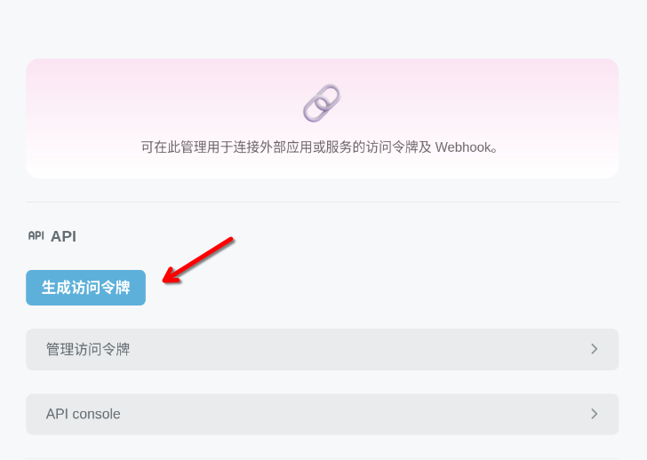
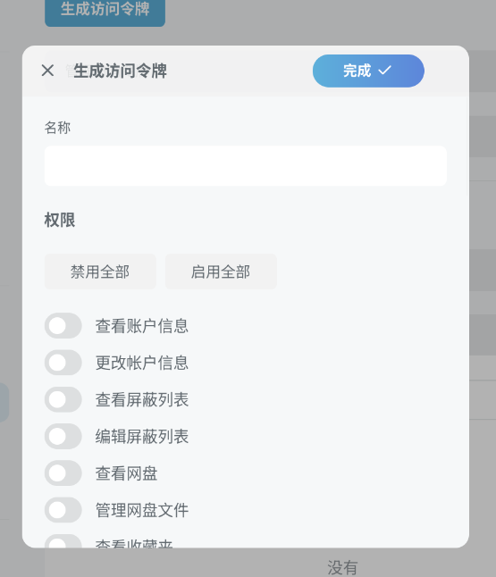
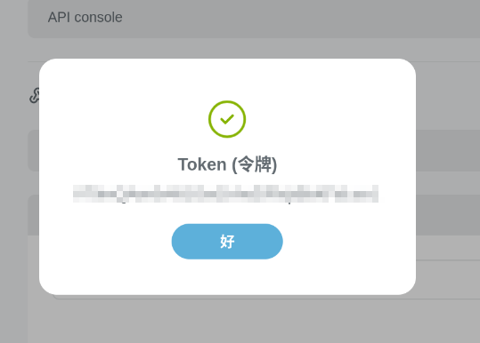
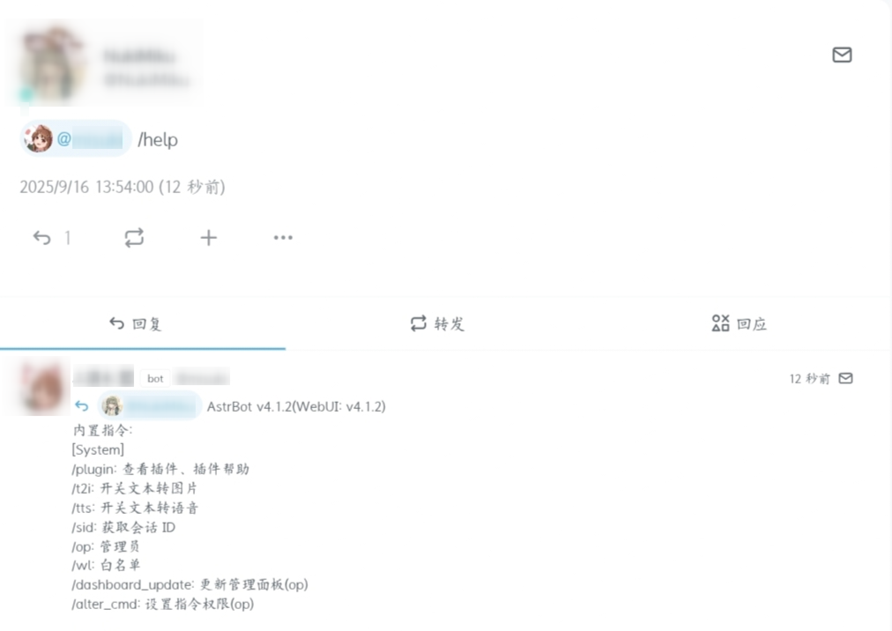
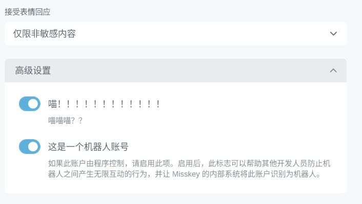

# 接入 Misskey 平台

> [!WARNING]
> 1. 我们建议您在非您参与管理的 Misskey 实例上部署 Bot 前请先查看实例规则或征求实例管理组或检察组的同意，并在部署后为机器人账号开启`Bot`标识。
> 2. 本项目严禁用于任何违反法律法规的用途。若您意图将 AstrBot 应用于非法产业或活动，我们明确反对并拒绝您使用本项目。

## 创建 Astrbot Misskey 平台适配器

进入消息平台，点击新增适配器，找到 Misskey 并单击进入 Misskey 配置页。

## 配置平台适配器设置

在 Astrbot Misskey 的平台适配器配置页，我们需要填写 Misskey 的接入信息和配置适配器的部分行为。

::: tip 注意
别忘了退出保存前先点击`启用`以启用 Misskey 平台配置器！
:::

获取 Misskey 接入信息的方式见下文介绍。

## Misskey 实例 URL

就是你的 Bot 所处账号的 Misskey 实例前端地址，格式为标准域名。例如`https://misskey.example`。

## 获取 Bot 账号 Access Token

1. 首先打开 Misskey Web 前端页面，在前端页面侧边栏找到并打开`设置 > 连接服务`页面。

2. 单击“生成访问令牌”以生成账号接入访问令牌。

3. 在弹出的访问令牌配置页面，我们为令牌起一个名字，比如`AstrBot`。

4. 然后我们需要为令牌配置相关权限让 Bot 能够与 Misskey 实例交互。

::: tip 注意
如果你使用的 Astrbot 第三方插件需要额外权限，请参考其文档增加相应权限。若你完全信任 Bot 的部署环境，也可以临时开启全部权限以简化调试，但仍建议您在生产环境使用时限制 Bot 的相关权限。
:::

**默认需要开启的权限**

| 权限名称 | 说明 | 用途 |
|---|---:|---|
| 读取账户信息 | 查看账户的基本信息 | 获取 Bot 自身的用户信息和账号 ID |
| 撰写或删除帖子 | 创建、编辑和删除笔记内容 | 发送消息回复和发布内容 |
| 撰写或删除消息 | 创建、编辑和删除私信内容 | 处理私信对话 |
| 查看通知 | 接收系统通知和提醒 | 获取提及、回复等通知信息 |
| 查看消息 | 读取私信和聊天记录 | 接收和处理用户私信 |
| 查看回应 | 查看帖子的回复和反应 | 处理用户对 Bot 消息的回应 |

5. 权限配置完成后，单击“完成”以查看账号访问令牌。把获取到的令牌复制并粘贴到 Astrbot 配置页面 Access Token 输入框内。

## 默认帖子可见性

修改机器人发帖时的默认可见性

| 名称 | 说明 |
|---|---|
| public | 任何人都可以看到 Bot 的帖子 |
| home | 公开 Bot 帖子于实例主页时间线 |
| followers | 只有关注了 Bot 账号的用户才能在主页时间线看到 Bot 帖子 |

## 仅限本站（不参与联合）

开启后，Bot 发送的所有帖子都不会参与 Fediverse 联合，非常适用于仅想在自己实例使用和传播 Bot 的帖子的需求。

## 测试成功性

配置完成并启用后，前往 Misskey 新建帖子并在发送中引用 Bot （@mention）测试效果。如果 Bot 账号能够成功触发回复，说明配置成功。

## 杂谈

我们建议您为 Bot 账号开启 Misskey `Bot` 标识以尊重 Misskey 各实例的相关规定和速率限制等，也能有效帮助 Misskey 实例管理员管理和识别 Bot 的使用情况。

**开启方式**

在 Bot 账号个人资料页面的高级设置中开启“这是一个机器人账号”即可。

