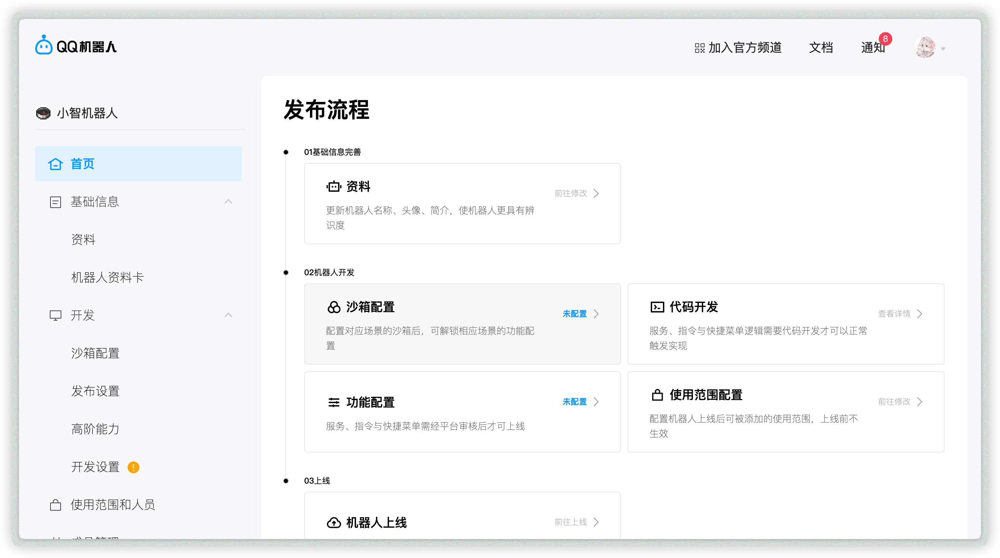
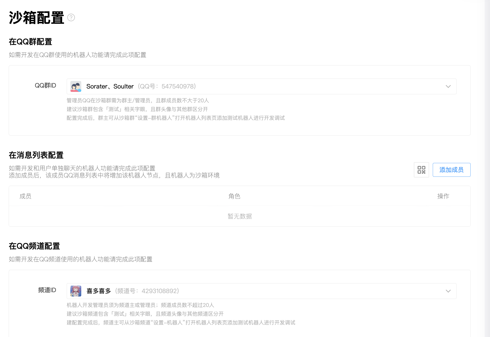
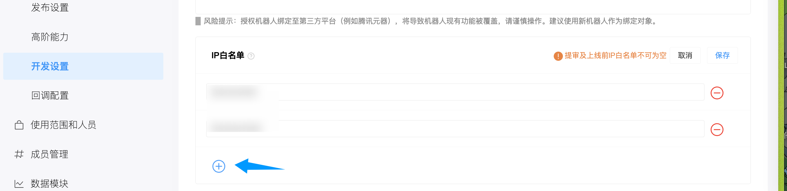
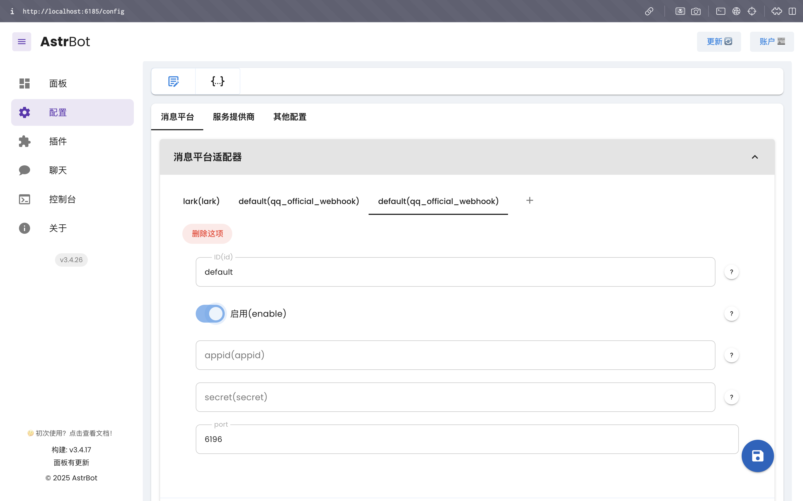
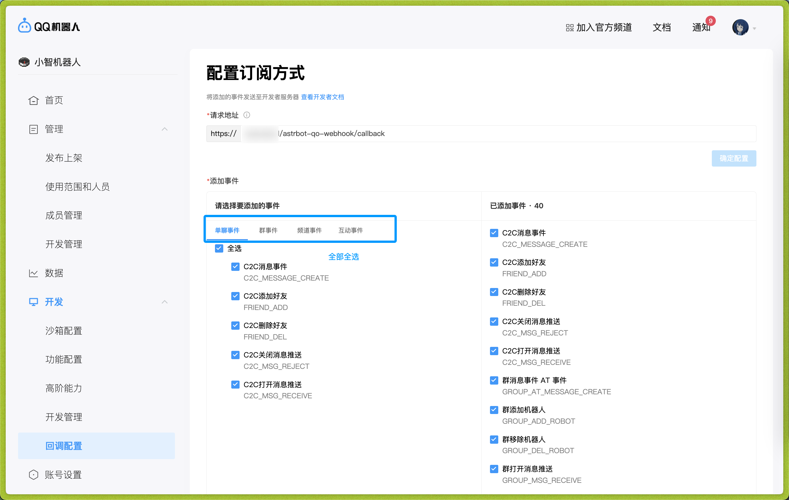

# 通过 QQ官方机器人 接入 QQ (Webhook)

## 申请一个机器人

> [!WARNING]
> 1. 截至目前，QQ 官方机器人需要设置 IP 白名单。
> 2. 支持群聊、私聊、频道聊天、频道私聊。
>
> 需要一台带有公网 IP 的服务器和域名（如果没备案，需要服务器在海外或者中国港澳台）

首先，打开 [QQ官方机器人](https://q.qq.com) 并登录。

然后，点击创建机器人，填写名称、简介、头像等信息。然后点击下一步、提交审核。等待安全校验通过后，创建成功。

点击创建好的机器人，然后你将会被导航到机器人的管理页面。如下图所示：

## 允许机器人加入频道/群/私聊

点击`沙箱配置`，这允许你立即设置一个沙箱频道/QQ群/QQ私聊，用于拉入机器人（需要小于等于20个人）。

然后你将会看到 QQ 群配置、消息列表配置和 QQ 频道配置。根据你的需求来选择QQ群、允许私聊的QQ号、QQ频道。

## 获取 appid、secret

添加机器人到你想用的地方后。

点击 `开发->开发设置`，找到 appid、secret。复制并保存它们。

## 添加 IP 白名单

点击 `开发->开发设置`，找到 IP 白名单。添加你的服务器 IP 地址。

## 在 AstrBot 配置

在 AstrBot 的管理面板中，选择左边栏的 `配置`，然后在右边的界面中，点击 `消息平台` 选项卡。点击 `+` 号，选择 `qq_official_webhook`，会出现 `qq_official_webhook` 的相关配置项，如下图所示：

配置项填写：

- ID(id)：随意填写，用于区分不同的消息平台实例。系统会自动填充。
- 启用(enable): 勾选。
- appid: 你在 QQ 官方机器人中获取的 appid。
- secret: 你在 QQ 官方机器人中获取的 secret。

点击 `保存`。

## 设置回调地址

在 `开发->回调配置` 处，配置回调地址。这需要你拥有一个公网 IP 服务器和域名。

请求地址填写 `<你的域名>/astrbot-qo-webhook/callback`

你的域名应当通过 `Caddy`, `Nginx`, `Apache` 等 Web 服务器反向代理来自 AstrBot 暴露的 `6196` 端口的流量。

填写好之后，添加事件，四个事件类型都全选：单聊事件、群事件、频道事件等，如下图。

输入完成后，将光标挪出输入框，将会发送一次验证请求。如果没问题，右边的确定配置按钮将可点击，点击即可。

接着重启 AstrBot。

## 🎉 大功告成！

此时，你的 AstrBot 应该已经连接成功。如果发送消息没有反应，请等待一两分钟后重启 AstrBot 再进行确认（测试时发现回调地址不会立即生效）。

## 附录：如何配置反向代理

如果你还没有相关经验，这里推荐使用 Caddy 作为反向代理的工具，请参考：

1. 安装 Caddy: https://caddy2.dengxiaolong.com/docs/install
2. 设置反向代理: https://caddy2.dengxiaolong.com/docs/quick-starts/reverse-proxy

Caddy 将自动为您申请 TLS 证书，以达到接入 Webhook 的目的。