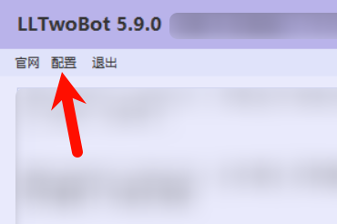
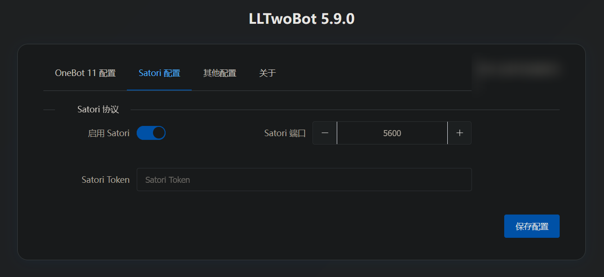
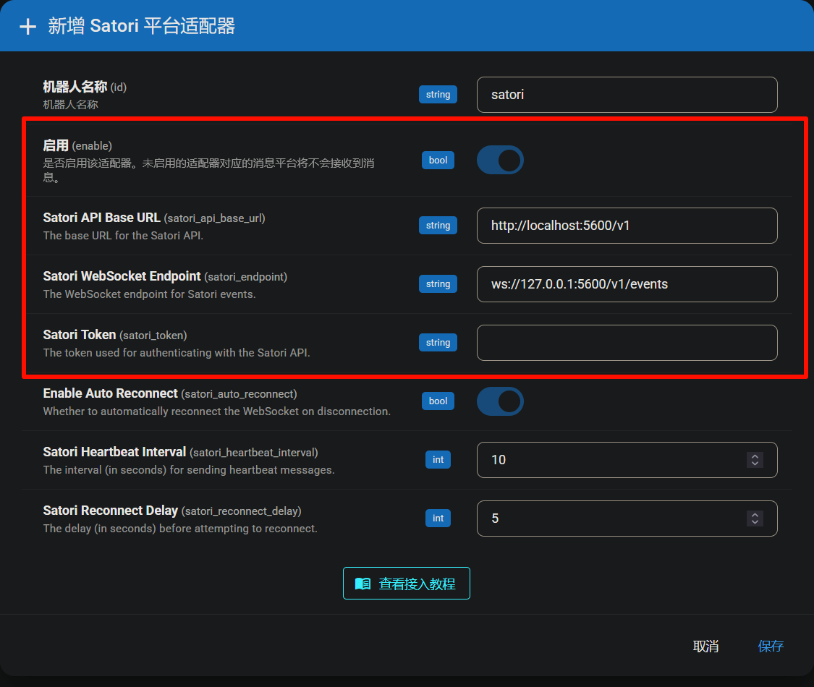

# 接入 LLOneBot (Satori)

> [!TIP]
> LLOneBot 是一个基于 QQNT 的 Onebot v11、Satori 多协议实现端，可以让你在 QQNT 环境下使用 Satori 协议与 AstrBot 进行通信。

> [!TIP]
> - 请合理控制使用频率。过于频繁地发送消息可能会被判定为异常行为，增加触发风控机制的风险。
> - 本项目严禁用于任何违反法律法规的用途。若您意图将 AstrBot 应用于非法产业或活动，我们**明确反对并拒绝**您使用本项目。

## 准备工作

请先参考 LLOneBot 官方文档完成基础配置：
[LLOneBot 文档](https://llonebot.com/guide/getting-started)

完成文档中的步骤，确保你已经：
1. 下载并安装了 LLOneBot
2. 成功登录了 QQ 账号

## 配置 LLOneBot 的 Satori 服务

在成功登录 QQ 后，先打开 LLOneBot 的 WebUI 配置界面。
> WebUI 默认地址为：http://localhost:3080/

在配置界面中，选择【Satori 配置】选项卡，进行如下配置：

1. 确认【启用 Satori】配置项已开启
2. 端口默认为 5600（如需修改请记住新端口）
3. 如有必要，可填写【Satori Token】
4. 点击右下角的【保存配置】

## 在 AstrBot 中配置 Satori 适配器

1. 进入 AstrBot 的管理面板
2. 点击左边栏 `消息平台`
3. 然后在右边的界面中，点击 `+ 新增适配器` 
4. 选择 `satori`

弹出的配置项填写：

- 启用(enable): 勾选。
- Satori API Base URL (satori_api_base_url)：`http://localhost:5600/v1`
- Satori WebSocket Endpoint (satori_endpoint)：`ws://localhost:5600/v1/events`
- Satori Token (satori_token)：根据 LLOneBot 配置填写（如有设置）

点击 `保存` 完成配置。

## 🎉 大功告成！

此时，你的 AstrBot 应该已经通过 Satori 协议成功连接到 LLOneBot。

在 QQ 中发送 `/help` 以检查是否连接成功。如果成功回复，则配置成功。

## 常见问题

如果遇到连接问题，请检查：
1. LLOneBot 是否正常运行
2. Satori 服务是否已启用
3. 端口配置是否正确
4. Token 是否匹配（如设置了 Token）