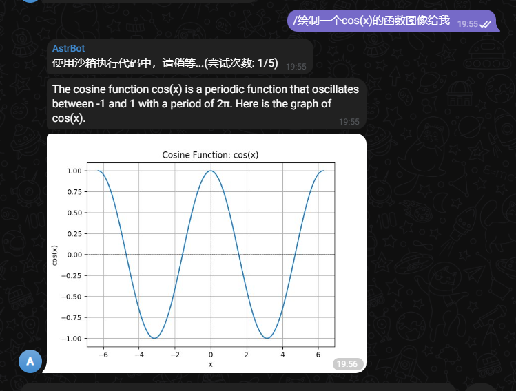

# 接入 Telegram

AstrBot 支持接入 Telegram，通过 `astrbot_plugin_telegram` 插件接入。

## 安装 astrbot_plugin_telegram 插件

在 AstrBot 的管理面板中，选择左边栏的 `插件`，下滑找到 `astrbot_plugin_telegram` 插件，点击 `安装`。

安装成功后，请查看 https://github.com/Soulter/astrbot_plugin_telegram 以查看使用方式。