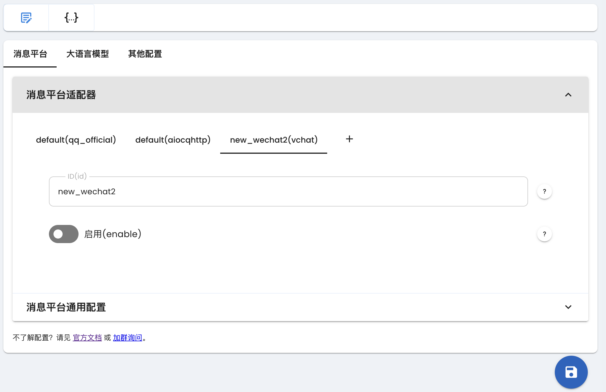
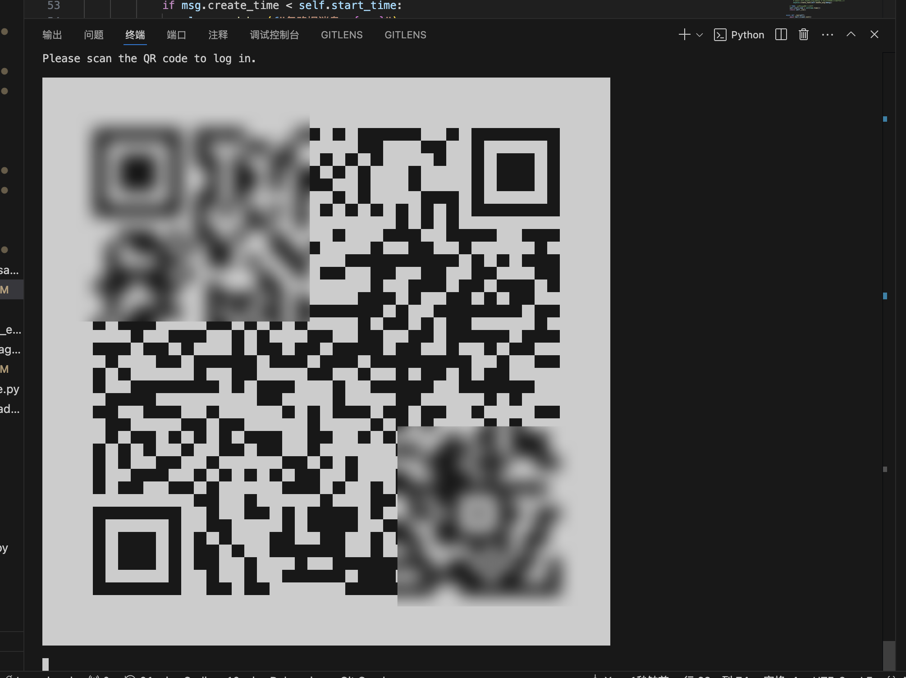

# 通过 VChat 接入微信

> [!WARNING]
> 1. 仅支持微信个人号
> 2. 微信限制，需要手动扫码登录
> 3. 微信限制一个微信号必须**有一台手机在线**才能登录电脑微信。而 VChat 是一个电脑微信客户端。因此，你需要有一台手机登录该微信，才能使用 VChat。（可以使用安卓虚拟机，详见下文）

## 在 AstrBot 中配置 VChat 适配器

在 AstrBot 的管理面板中，选择左边栏的 `配置`，然后在右边的界面中，点击 `消息平台` 选项卡。点击 `+` 号，选择 `vchat`，会出现 `vchat` 的相关配置项，如下图所示：



勾选 `启用`，然后点击 `保存`。

## 扫码登录

查看 AstrBot 的终端日志输出，会出现登录二维码：



使用你的微信扫描二维码，即可登录。

> [!WARNING]
> 在管理面板的控制台中看不到二维码，你需要在终端中查看日志。
>
> 如果没有看到打印的二维码，可以在运行目录下寻找到 `QR.svg` 文件，用浏览器打开。

如果你使用 Docker 部署 AstrBot，可以使用以下命令查看日志：

```bash
docker logs astrbot
```

## 设置白名单

由于微信的 ID 是一段非常长的随机字符串，因此没办法通过默认设置 AstrBot 管理员的方式来设置初始会话。操作步骤如下：

1. 给机器人号随便发一条消息，在终端中会出现 `会话 xxx 不在会话白名单中，已终止事件传播。` 的日志（日志等级为 `INFO`）。
2. 复制 `xxx` 的值。
3. 在管理面板 `配置->消息平台->消息平台通用配置` 中找到 `ID 白名单`，粘贴 `xxx` 的值，回车填入。
4. 点击 `保存`，等待 AstrBot 重启。
5. 尝试发送 `/help` 命令，看是否有响应。