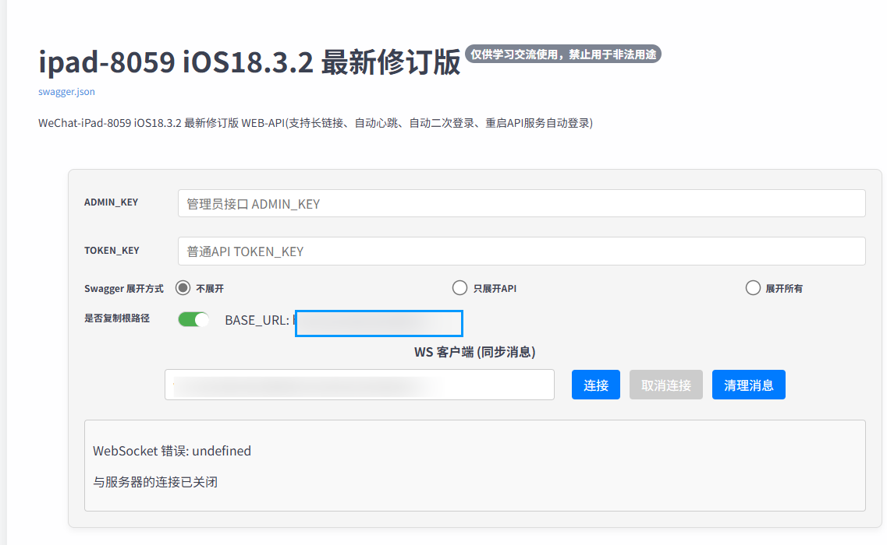
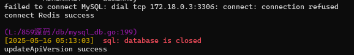
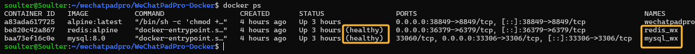
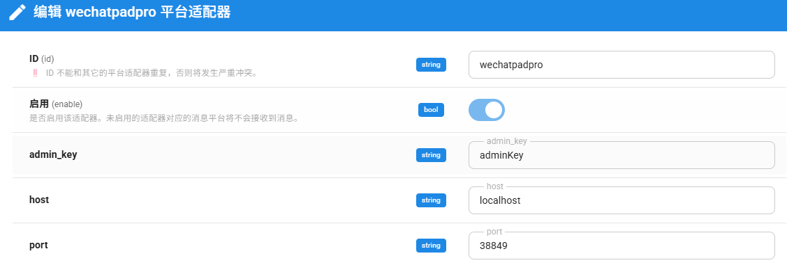
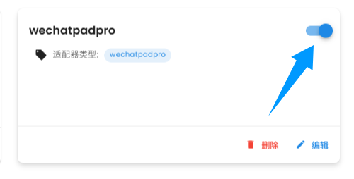

# 通过 WeChatPadPro 接入微信

**需要 AstrBot 版本 >= 3.5.10**

> [!NOTE]
>
> 1. 这个接入方式不受微信官方支持，请注意风险。**我们建议使用受微信官方支持的方式，即使用企业微信、微信客服、微信公众号方式接入**。
> 
> 2. 请控制聊天频率。如果过于频繁使用（同一时间发送消息次数过多），可能会导致更高的风控风险，请注意使用频率。

> [!WARNING]
> 1. 仅支持微信个人号
> 2. 微信限制，需要手动扫码登录
> 3. 微信限制一个微信号必须**有一台手机在线**才能登录其他端。因此，你需要有一台手机登录该微信，才能使用该接入方式。请尽量保证手机和部署地设备处于同一城市。


## 部署 WeChatPadPro

有两种部署方式：

- 不通过 Docker 部署
- 通过 Docker 部署

### 不通过 Docker 部署

打开 [WeChatPadPro](https://github.com/luolin-ai/WeChatPadPro)，请按照其 README 提供的部署方式部署。一般来说，最终你会部署一下三个软件：

- MySQL
- Redis
- WeChatPadPro

并且可以通过 `http://ip:port`（ip 是 localhost 或你的公网 IP；port 是 `asset/setting.json` 中你定义的 `port` 中的端口号）打开如下页面：



AstrBot 的成功接入依赖于您是否能够打开这个页面。

### 通过 Docker 部署

仅在 Linux 上测试了部署的成功性。

> [!TIP]
> 不支持 `arm64` 架构的设备。

```bash
git clone https://github.com/bclz-wyz/WeChatPadPro-Docker --depth 1
cd WeChatPadPro-Docker
mkdir main && mkdir mysql && cd main
git clone https://github.com/luolin-ai/WeChatPadPro --depth 1
mv WeChatPadPro/* . # 需要将 WeChatPadPro 内所有文件放到 main 文件夹下
unzip 859_service_linux.zip # 这一步会释出 stay 可执行文件
cd .. # 回到 WeChatPadPro-Docker 目录
mv setting.json main/assets/setting.json # 覆盖 WeChatPadPro 原来的 setting.json 文件。
```

你可以根据你的需要，编辑 `main/assets/setting.json` 文件，也可以不编辑。建议将 `adminKey` 修改为更安全的密码。

接下来，运行容器。

```bash
docker compose up -d && docker logs wechatpadpro
```

正常情况下，会出现如下日志：

```
版本号: v20250515.00
WeChatPadPro
🚀 基于 WeChat Pad 协议的高级微信管理工具 🚀
...
...
如有任何问题或建议，欢迎通过 GitHub Issues 或邮件与我们联系。
======== ADMIN_KEY === ****** ========
connect MySQL success
auto create MySQL tables success
connect Redis success
updateApiVersion success
```

如果你发现出现了报错：


 
这是因为 MySQL 容器还没有启动成功。


请执行 `docker ps` 查看另外两个容器 `wx_redis` 和 `wx_mysql` 是否 healthy。



在 healthy 后，重启 `wechatpadpro` 容器：

```bash
docker restart wechatpadpro
```

## 接入 AstrBot

成功部署后，进入 AstrBot WebUI:

打开消息平台 -> 新增适配器 -> wechatpadpro(微信)。



- admin_key: 上面步骤中，`setting.json` 下的 `adminKey` 的值。
- host 和 port：取决于你的部署情况。host 填写部署 WeChatPadPro 项目的机器的主机地址。port 填写 `setting.json` 中的 port。如果是 WeChatPadPro-Docker 部署，默认映射到了 38849 端口，如您没修改，填写这个端口即可。

填写完成后，点击保存。

进入`控制台`，查看日志，如果连接成功，会出现如下日志：

```
 [12:50:16] [Core] [INFO] [wechatpadpro.wechatpadpro_adapter:69]: WeChatPadPro 设备不在线或无可用凭据，开始扫码登录流程。 
 [12:50:16] [Core] [INFO] [wechatpadpro.wechatpadpro_adapter:189]: 成功获取授权码 
 [12:50:16] [Core] [INFO] [wechatpadpro.wechatpadpro_adapter:81]: 请扫描以下二维码登录: https://api.pwmqr.com/qrcode/create/?url=http://weixin.qq.com/x/xxx
 [12:50:16] [Core] [INFO] [wechatpadpro.wechatpadpro_adapter:251]: 请在 30 秒内扫码登录！！！ 
```

请打开微信扫码即可，如果超出了 30 秒，重新关开这个平台适配器即可：



## 常见问题

### 接收不到消息！！！

1. 检查 WeChatPadPro 是否正常启动
2. 检查 AstrBot WebUI 控制台日志，是否有与 WeChatPadPro 相关的报错
3. 如果一切无误，请尝试在平台适配器配置中启用 `是否启用主动消息轮询`