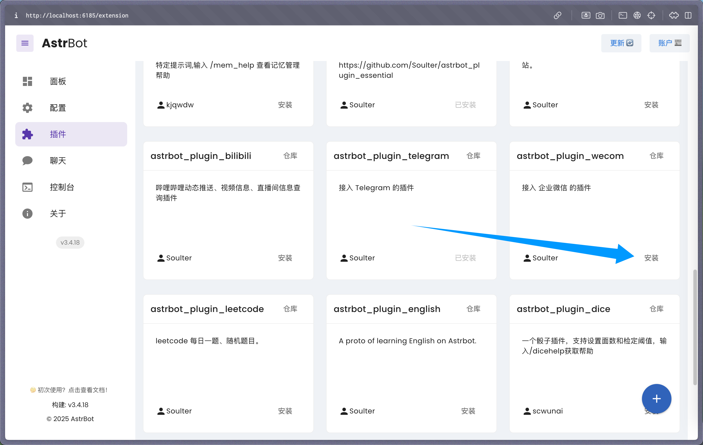
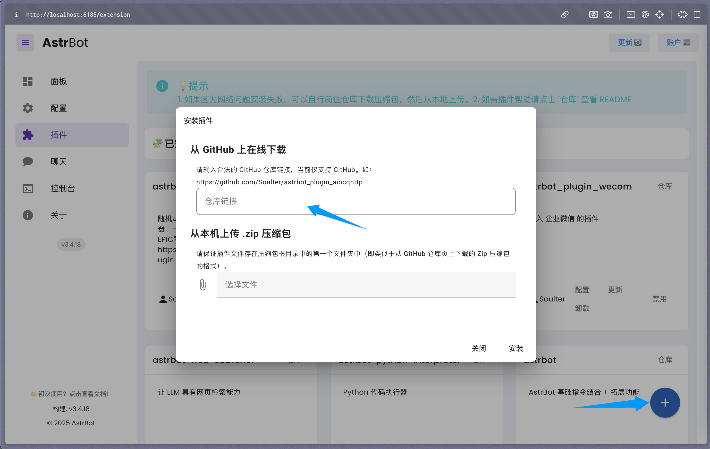
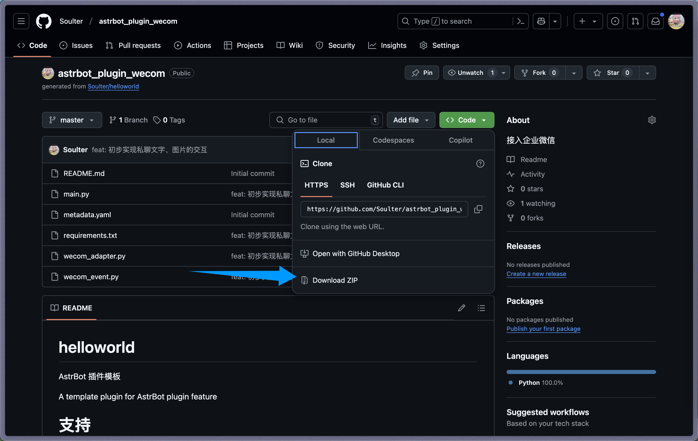
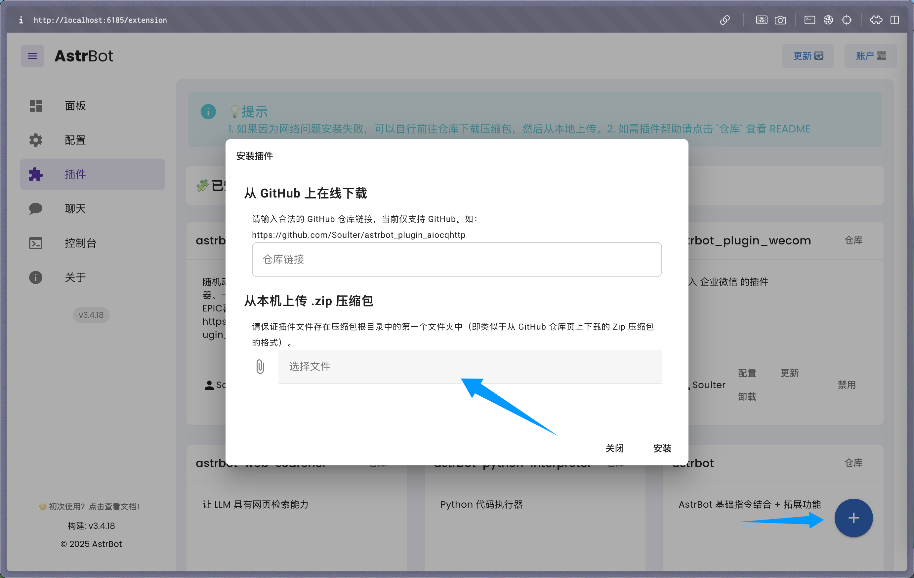
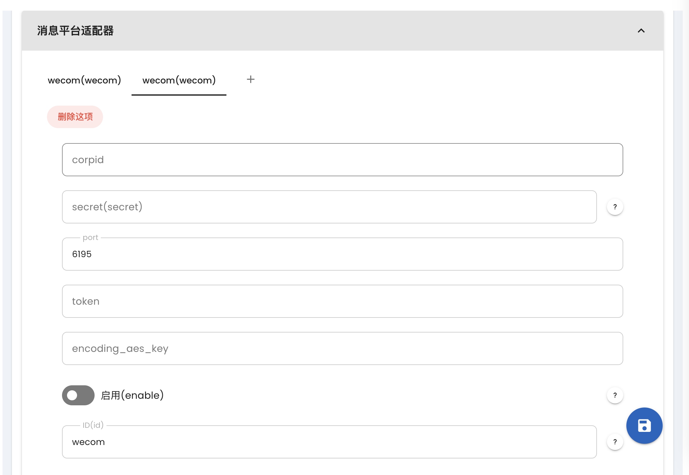
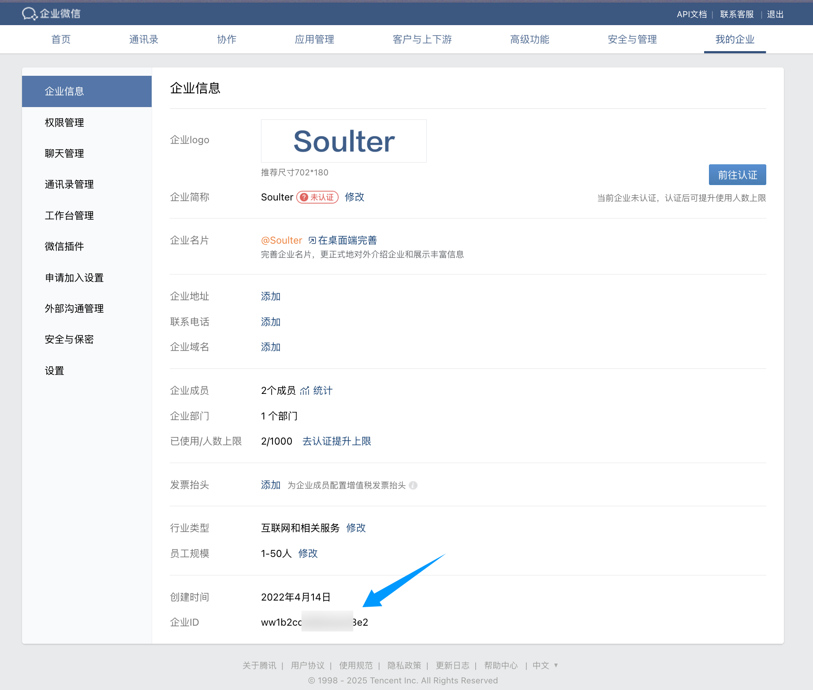
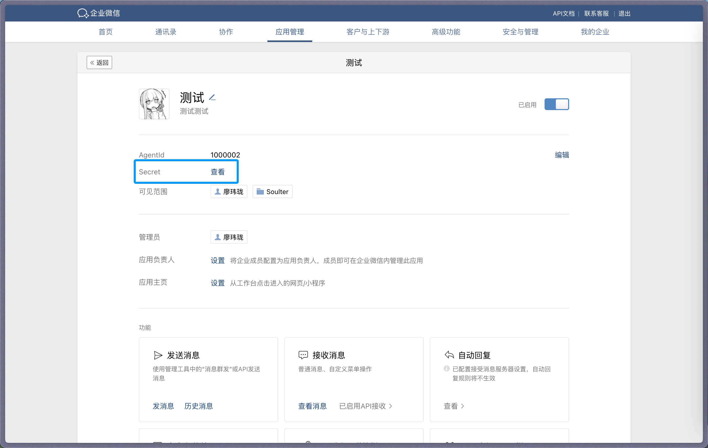
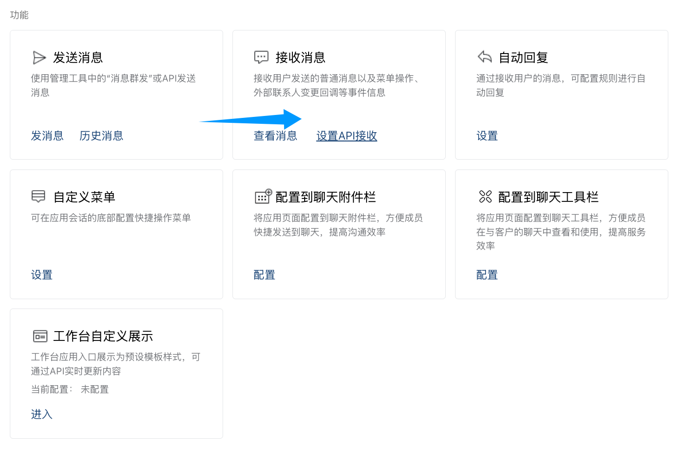
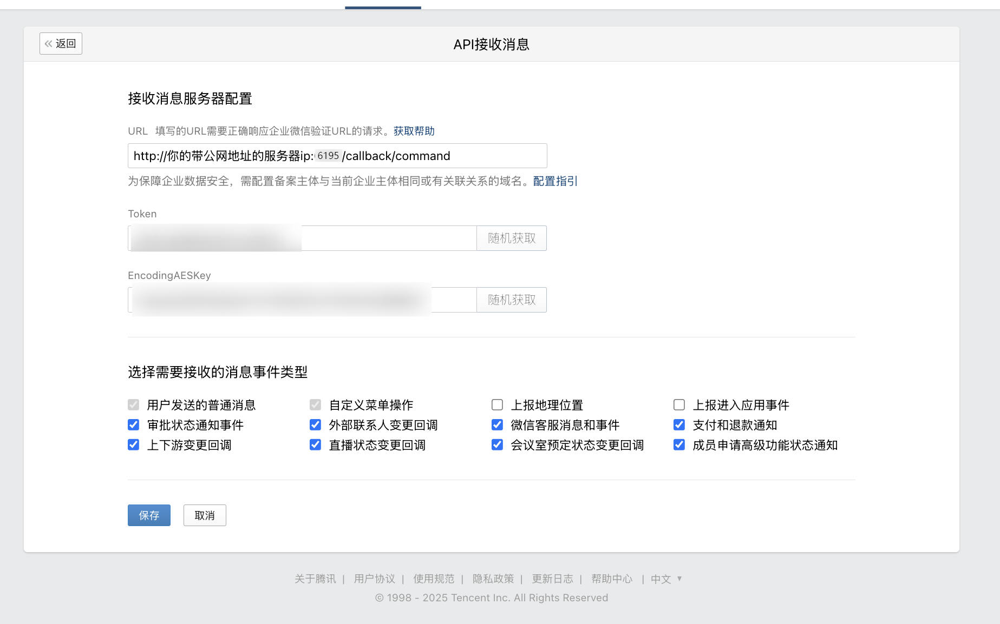
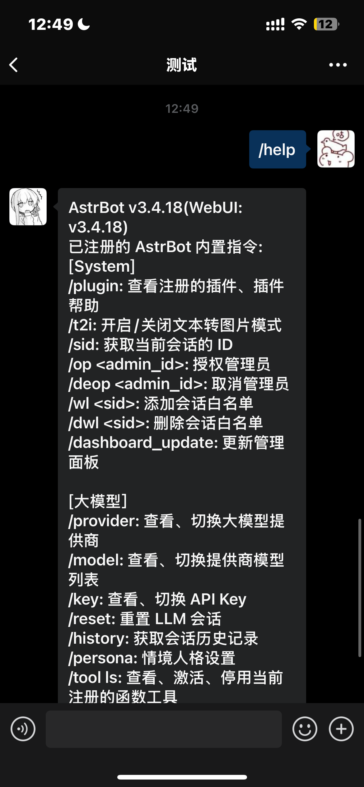

# AstrBot 接入企业微信

AstrBot 支持接入企业微信。

> 当前只能作为企业微信应用来私聊，无法在群聊中使用。
> 
> 请等待后续更新。

## 下载 astrbot_plugin_wecom

### 通过插件市场安装（推荐）
在插件页-插件市场安装好 `astrbot_plugin_wecom` 插件。

### 通过链接安装

链接输入 `https://github.com/Soulter/astrbot_plugin_wecom`

### 通过上传压缩包的方式安装

如果插件市场显示不了任何插件，请前往 `https://github.com/Soulter/astrbot_plugin_wecom` 手动下载插件压缩包来安装

然后上传即可：

## 配置插件

点击配置页->消息平台适配器，点击加号，选择 `wecom`，会出现 `wecom` 的相关配置项，如下图所示：

接下来，不要关闭页面，转移到下一步。

## 配置企业微信

进入 https://work.weixin.qq.com/wework_admin/frame#apps

点击 `我的企业`，查看并得到企业 ID（`Corpid`），复制到 AstrBot 配置的 `corpid` 处。

点击下面的 `自建应用`，然后点击 `创建应用`，填写好应用名称、头像、应用可见范围等信息。

进入应用，查看并得到机器人的 `Secret`，复制到 AstrBot 配置的 `secret` 处。

在下方，找到 `接收消息`，点击 `设置 API 接收`，进入 API 接收页面。

在 URL 处填入 `http://你的带公网地址的服务器ip:6185/callback/command`

并且点击下方的两个随机获取，得到 `Token` 和 `EncodingAESKey`，复制到 AstrBot 配置的 `token` 和 `encoding_aes_key` 处。

现在应该已经填完 AstrBot 连接到企业微信的所有配置项。点击 AstrBot 配置页右下角保存，等待 AstrBot 重启。

重启成功后，回到API 接收页面，点击下面的保存，看是否能够保存成功。如果出现 `openapi 请求回调地址不通过` 说明配置有问题，请检查四个配置项是否填写正确。

如果能够保存成功，AstrBot 就已经能够接收信息。

## 测试

在企业微信-工作台中，找到刚刚创建的应用，发送 `/help`，看看 AstrBot 是否能够回复。

## 语音输入

为了语音输入，需要你的电脑上安装有 `ffmpeg`。

linux 用户可以使用 `apt install ffmpeg` 安装。

windows 用户可以在 [ffmpeg 官网](https://ffmpeg.org/download.html) 下载安装。

mac 用户可以使用 `brew install ffmpeg` 安装。   