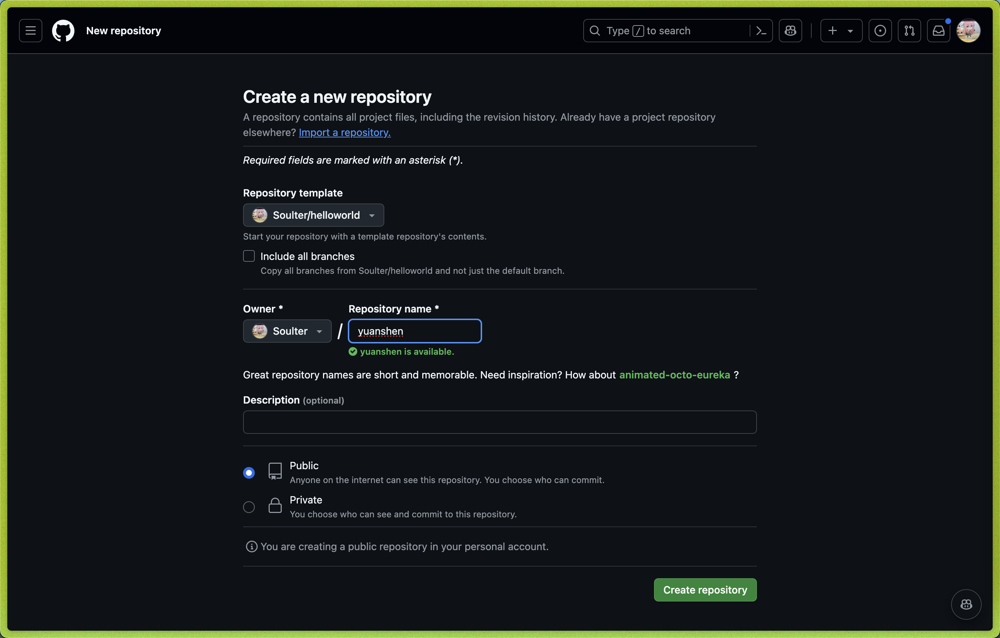
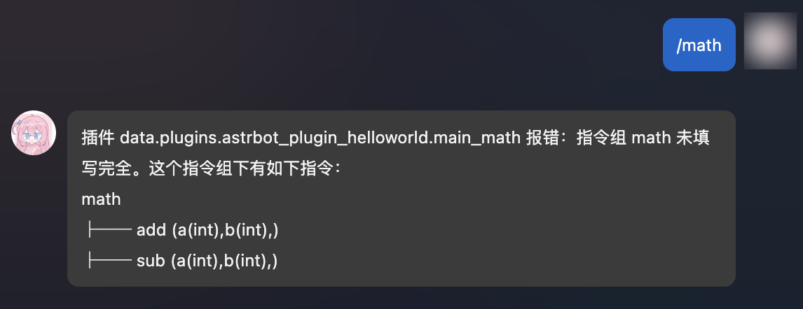
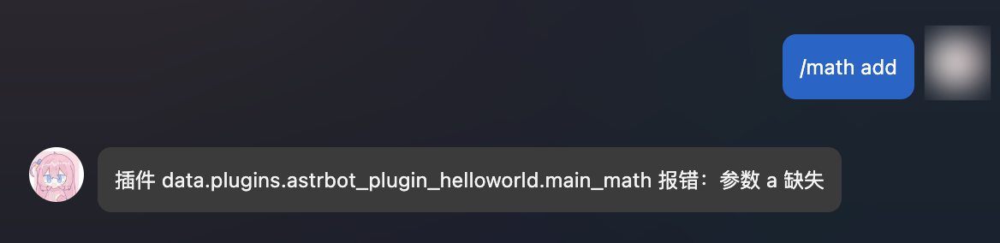
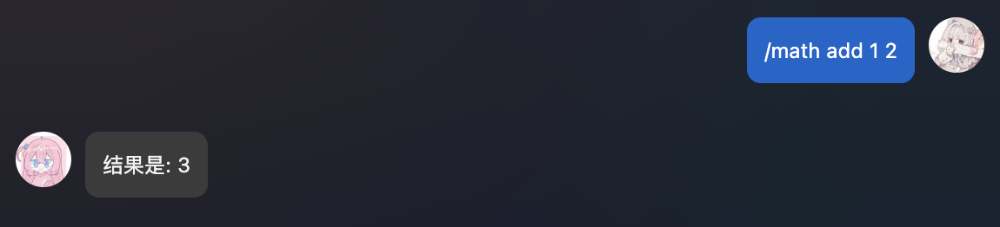
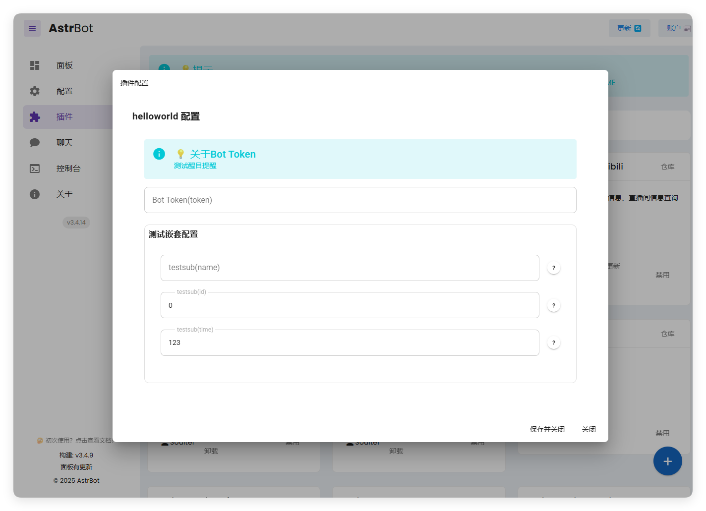
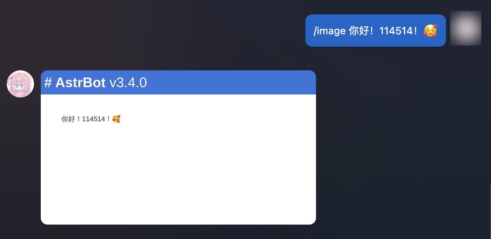
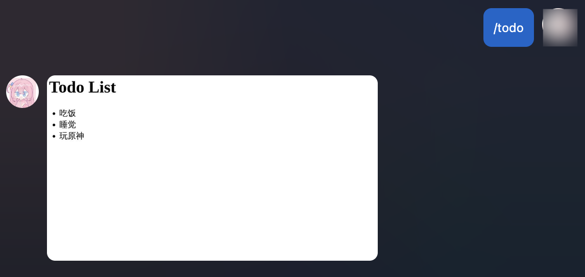

# 插件开发

几行代码开发一个插件！

> [!TIP]
> - 推荐使用 VSCode 开发。
> - 需要有一定的 Python 基础。
> - 需要有一定的 Git 使用经验。
>
> 欢迎加群 `322154837` 讨论！！

## 开发环境准备

### 获取插件模板

打开 [helloworld](https://github.com/Soulter/helloworld)。点击右上角的 `Use this template`，然后点击 `Create new repository`。在 `Repository name` 处输入你的插件名字，不要中文。建议以 `astrbot_plugin_` 开头，如 `astrbot_plugin_genshin`。



然后点击右下角的 `Create repository`。

### Clone 插件和 AstrBot 项目

首先 Clone AstrBot 项目本体到本地。

```bash
git clone https://github.com/Soulter/AstrBot
mkdir -p AstrBot/data/plugins
cd AstrBot/data/plugins
git clone <你的插件仓库地址>
```

然后，使用 VSCode 打开 AstrBot 项目。找到 `data/plugins/<你的插件名字>` 目录。

开发环境准备完毕！

## 提要

### 最小实例

打开 `main.py`，这是一个最小的插件实例。

```python
from astrbot.api.event import filter, AstrMessageEvent, MessageEventResult
from astrbot.api.star import Context, Star, register

# 注册插件的装饰器
@register("helloworld", "Your Name", "一个简单的 Hello World 插件", "1.0.0")
class MyPlugin(Star):
    def __init__(self, context: Context):
        super().__init__(context)
    
    # 注册指令的装饰器。指令名为 helloworld。注册成功后，发送 `/helloworld` 就会触发这个指令，并回复 `你好, {user_name}!`
    @filter.command("helloworld")
    async def helloworld(self, event: AstrMessageEvent):
        user_name = event.get_sender_name()
        yield event.plain_result(f"Hello, {user_name}!") # 发送一条纯文本消息
```

一个插件就是一个类，这个类继承自 `Star`。`Star` 是 AstrBot 插件的基类，还额外提供了一些基础的功能。请务必使用 `@register` 装饰器注册插件，否则 AstrBot 无法识别。在 AstrBot 中，插件也叫做 `Star`。

在 `__init__` 中会传入一个 `Context` 对象，这个对象包含了 AstrBot 的一些基础信息。

具体的处理函数在插件类中定义，叫做 `Star Handler`，比如这里的 `helloworld` 函数。

> [!WARNING]
>
> `Star Handler` 请务必写在插件类中，前两个参数必须是 `self` 和 `event`。
>
> `Star` 类所在的文件名需要命名为 `main.py`。
> 

### API 文件结构

所有的 API 都在 `astrbot/api` 目录下。

```
api
├── __init__.py
├── all.py # 无脑使用所有的结构
├── event 
│   └── filter # 过滤器，事件钩子
├── message_components.py # 消息段组建类型
├── platform # 平台相关的结构
├── provider # 大语言模型提供商相关的结构
└── star
```

如果你觉得麻烦，可以直接使用 `all.py` 导入所有的 API。

```python
from astrbot.api.all import *
```

### AstrMessageEvent

`AstrMessageEvent` 是 AstrBot 的消息事件对象。你可以通过 `AstrMessageEvent` 来获取消息发送者、消息内容等信息。里面的方法都有足够的注释。

### AstrBotMessage

`AstrBotMessage` 是 AstrBot 的消息对象。你可以通过 `AstrBotMessage` 来查看消息适配器下发的消息的具体内容。通过 `event.message_obj` 获取。

```py{11}
class AstrBotMessage:
    '''AstrBot 的消息对象'''
    type: MessageType  # 消息类型
    self_id: str  # 机器人的识别id
    session_id: str  # 会话id。取决于 unique_session 的设置。
    message_id: str  # 消息id
    group_id: str = "" # 群组id，如果为私聊，则为空
    sender: MessageMember  # 发送者
    message: List[BaseMessageComponent]  # 消息链。比如 [Plain("Hello"), At(qq=123456)]
    message_str: str  # 最直观的纯文本消息字符串，将消息链中的 Plain 消息（文本消息）连接起来
    raw_message: object
    timestamp: int  # 消息时间戳
```

其中，`raw_message` 是消息平台适配器的**原始消息对象**。

### 消息链的元素种类

消息链的结构使用了 `nakuru-project`。它一共有如下种消息类型。常用的已经用注释标注

```py
ComponentTypes = {
    "plain": Plain, # 文本消息
    "text": Plain, # 文本消息
    "face": Face, # QQ 表情
    "record": Record, # 语音
    "video": Video, # 视频
    "at": At, # At 消息发送者
    "rps": RPS, 
    "dice": Dice, 
    "shake": Shake,
    "anonymous": Anonymous,
    "share": Share,
    "contact": Contact,
    "location": Location,
    "music": Music, # 音乐
    "image": Image, # 图片
    "reply": Reply, # 回复消息
    "redbag": RedBag,
    "poke": Poke,
    "forward": Forward, # 转发消息
    "node": Node, # 转发消息中的节点
    "xml": Xml,
    "json": Json,
    "cardimage": CardImage,
    "tts": TTS,
    "unknown": Unknown
}
```

请善于 debug 来了解消息结构：

```python{3}
@event_message_type(EventMessageType.ALL) # 注册一个过滤器，参见下文。
async def on_message(self, event: AstrMessageEvent):
    print(event.message_obj.raw_message) # 打印消息内容

```


## 开发指南

> [!CAUTION]
>
> 接下来的代码中处理函数可能会忽略插件类的定义，但请记住，所有的处理函数都需要写在插件类中。

### 事件过滤器

事件过滤器可以帮助您过滤事件，可以实现指令、指令组、事件监听等功能。

#### 注册一个指令

```python
from astrbot.api.all import *

@register("helloworld", "Soulter", "一个简单的 Hello World 插件", "1.0.0")
class MyPlugin(Star):
    def __init__(self, context: Context):
        super().__init__(context)
    
    @command("helloworld") # from astrbot.api.event.filter import command
    async def helloworld(self, event: AstrMessageEvent):
        user_name = event.get_sender_name()
        yield event.plain_result(f"Hello, {user_name}!")
```

#### 注册一个带参数的指令

AstrBot 会自动帮你解析指令的参数。

```python
@command("echo")
def echo(self, event: AstrMessageEvent, message: str):
    yield event.plain_result(f"你发了: {message}")

@command("add")
def add(self, event: AstrMessageEvent, a: int, b: int):
    # /add 1 2 -> 结果是: 3
    yield event.plain_result(f"结果是: {a + b}")
```

#### 注册一个指令组

指令组可以帮助你组织指令。

```python
@command_group("math")
def math(self):
    pass

@math.command("add")
async def add(self, event: AstrMessageEvent, a: int, b: int):
    # /math add 1 2 -> 结果是: 3
    yield event.plain_result(f"结果是: {a + b}")

@math.command("sub")
async def sub(self, event: AstrMessageEvent, a: int, b: int):
    # /math sub 1 2 -> 结果是: -1
    yield event.plain_result(f"结果是: {a - b}")
```

指令组函数内不需要实现任何函数，请直接 `pass` 或者添加函数内注释。指令组的子指令使用 `指令组名.command` 来注册。

当用户没有输入子指令时，会报错并，并渲染出该指令组的树形结构。







理论上，指令组可以无限嵌套！

```py
'''
math
├── calc
│   ├── add (a(int),b(int),)
│   ├── sub (a(int),b(int),)
│   ├── help (无参数指令)
'''

@command_group("math")
def math():
    pass

@math.group("calc") # 请注意，这里是 group，而不是 command_group
def calc():
    pass

@calc.command("add")
async def add(self, event: AstrMessageEvent, a: int, b: int):
    yield event.plain_result(f"结果是: {a + b}")

@calc.command("sub")
async def sub(self, event: AstrMessageEvent, a: int, b: int):
    yield event.plain_result(f"结果是: {a - b}")

@calc.command("help")
def calc_help(self, event: AstrMessageEvent):
    # /math calc help
    yield event.plain_result("这是一个计算器插件，拥有 add, sub 指令。")
```

#### 过滤群/私聊事件

```python
@event_message_type(EventMessageType.PRIVATE_MESSAGE)
async def on_private_message(self, event: AstrMessageEvent):
    yield event.plain_result("收到了一条私聊消息。")
```

`EventMessageType` 是一个 `Enum` 类型，包含了所有的事件类型。当前的事件类型有 `PRIVATE_MESSAGE` 和 `GROUP_MESSAGE`。


#### 接收所有事件

```python
@event_message_type(EventMessageType.ALL)
async def on_private_message(self, event: AstrMessageEvent):
    yield event.plain_result("收到了一条消息。")
```

#### 过滤某个消息适配器事件

```python
@platform_adapter_type(PlatformAdapterType.AIOCQHTTP | PlatformAdapterType.QQOFFICIAL)
async def on_aiocqhttp(self, event: AstrMessageEvent):
    '''只接收 AIOCQHTTP 和 QQOFFICIAL 的消息'''
    yield event.plain_result("收到了一条信息")
```

当前版本下，`PlatformAdapterType` 有 `AIOCQHTTP`, `QQOFFICIAL`, `GEWECHAT`, `ALL`。


### 限制管理员才能使用指令

```python
@permission_type(PermissionType.ADMIN)
@command("test")
async def test(self, event: AstrMessageEvent):
    pass
```

仅管理员才能使用 `test` 指令。


#### 多个过滤器

支持同时使用多个过滤器，只需要在函数上添加多个装饰器即可。过滤器使用 `AND` 逻辑。也就是说，只有所有的过滤器都通过了，才会执行函数。

```python
@command("helloworld")
@event_message_type(EventMessageType.PRIVATE_MESSAGE)
async def helloworld(self, event: AstrMessageEvent):
    yield event.plain_result("你好！")
```

### 事件钩子【New】

#### 收到 LLM 请求时

在 AstrBot 默认的执行流程中，在调用 LLM 前，会触发 `on_llm_request` 钩子。

可以获取到 `ProviderRequest` 对象，可以对其进行修改。

ProviderRequest 对象包含了 LLM 请求的所有信息，包括请求的文本、系统提示等。

```python
from astrbot.api.provider import ProviderRequest

@filter.on_llm_request()
async def my_custom_hook_1(self, event: AstrMessageEvent, req: ProviderRequest): # 请注意有三个参数
    print(req) # 打印请求的文本
    req.system_prompt += "自定义 system_prompt" 

```

#### LLM 请求完成时

在 LLM 请求完成后，会触发 `on_llm_response` 钩子。

可以获取到 `ProviderResponse` 对象，可以对其进行修改。

```python
from astrbot.api.provider import LLMResponse

@filter.on_llm_response()
async def on_llm_resp(self, event: AstrMessageEvent, resp: LLMResponse): # 请注意有三个参数
    print(resp)
```

#### 发送消息给消息平台适配器前

在发送消息前，会触发 `on_decorating_result` 钩子。

可以在这里实现一些消息的装饰，比如转语音、转图片、加前缀等等

```python
@filter.on_decorating_result()
async def on_decorating_result(self, event: AstrMessageEvent):
    print(event.get_result()) # 打印消息链
```

#### 发送消息给消息平台适配器后

在发送消息给消息平台后，会触发 `after_message_sent` 钩子。

```python
@filter.after_message_sent()
async def after_message_sent(self, event: AstrMessageEvent):
    pass
```

### 发送消息

上面介绍的都是基于 `yield` 的方式，也就是异步生成器。这样的好处是可以在一个函数中多次发送消息。

```python
@command("helloworld")
async def helloworld(self, event: AstrMessageEvent):
    yield event.plain_result("Hello!")
    yield event.plain_result("你好！")

    yield event.image_result("path/to/image.jpg") # 发送图片
    yield event.image_result("https://example.com/image.jpg") # 发送 URL 图片，务必以 http 或 https 开头
```

如果是一些定时任务或者不想立即发送消息，可以使用 `event.unified_msg_origin` 得到一个字符串并将其存储，然后在想发送消息的时候使用 `self.context.send_message(unified_msg_origin, chains)` 来发送消息。


```python
from astrbot.api.event import MessageChain

@command("helloworld")
async def helloworld(self, event: AstrMessageEvent):
    umo = event.unified_msg_origin
    message_chain = MessageChain().message("Hello!").file_image("path/to/image.jpg")
    await self.context.send_message(event.unified_msg_origin, message_chain)
```

通过这个特性，你可以将 unified_msg_origin 存储起来，然后在需要的时候发送消息。

>[!TIP]
> 关于 unified_msg_origin。
> unified_msg_origin 是一个字符串，记录了一个会话的唯一ID，AstrBot能够据此找到属于哪个消息平台的哪个会话。这样就能够实现在 `send_message` 的时候，发送消息到正确的会话。有关 MessageChain，请参见接下来的一节。

### 发送图文等富媒体消息

AstrBot 支持发送富媒体消息，比如图片、语音、视频等。使用 `MessageChain` 来构建消息。

```python
from astrbot.api.message_components import *

@command("helloworld")
async def helloworld(self, event: AstrMessageEvent):
    chain = [
        At(qq=event.get_sender_id()), # At 消息发送者
        Plain("来看这个图："), 
        Image.fromURL("https://example.com/image.jpg"), # 从 URL 发送图片
        Image.fromFileSystem("path/to/image.jpg"), # 从本地文件目录发送图片
        Plain("这是一个图片。")
    ]
    yield event.chain_result(chain)
```

上面构建了一个 `message chain`，也就是消息链，最终会发送一条包含了图片和文字的消息，并且保留顺序。

你也可以快捷发送图文而不用显式构建 `message chain`。

```python
yield event.make_result().message("文本消息")
                        .url_image("https://example.com/image.jpg")
                        .file_image("path/to/image.jpg")
```

### 控制事件传播

```python{6}
@command("check_ok")
async def check_ok(self, event: AstrMessageEvent):
    ok = self.check() # 自己的逻辑
    if not ok:
        yield event.plain_result("检查失败")
        event.stop_event() # 停止事件传播
```

当事件停止传播，**后续所有步骤将不会被执行。**假设有一个插件A，A终止事件传播之后所有后续操作都不会执行，比如执行其它插件的handler、请求LLM。

### 注册插件配置(beta)

> 大于等于 v3.4.15

随着插件功能的增加，可能需要定义一些配置以让用户自定义插件的行为。

AstrBot 提供了”强大“的配置解析和可视化功能。能够让用户在管理面板上直接配置插件，而不需要修改代码。



**Schema 介绍**

要注册配置，首先需要在您的插件目录下添加一个 `_conf_schema.json` 的 json 文件。

文件内容是一个 `Schema`（模式），用于表示配置。Schema 是 json 格式的，例如上图的 Schema 是：

```json
{
    "token": {
        "description": "Bot Token",
        "type": "string",
        "hint": "测试醒目提醒",
        "obvious_hint": true
    },
    "sub_config": {
        "description": "测试嵌套配置",
        "type": "object",
        "hint": "xxxx",
        "items": {
            "name": {
                "description": "testsub",
                "type": "string",
                "hint": "xxxx"
            },
            "id": {
                "description": "testsub",
                "type": "int",
                "hint": "xxxx"
            },
            "time": {
                "description": "testsub",
                "type": "int",
                "hint": "xxxx",
                "default": 123
            }
        }
    }
}
```
- `type`: **此项必填**。配置的类型。支持 `string`, `int`, `float`, `bool`, `object`, `list`。
- `description`: 可选。配置的描述。建议一句话描述配置的行为。
- `hint`: 可选。配置的提示信息，表现在上图中右边的问号按钮，当鼠标悬浮在问号按钮上时显示。
- `obvious_hint`: 可选。配置的 hint 是否醒目显示。如上图的 `token`。
- `default`: 可选。配置的默认值。如果用户没有配置，将使用默认值。int 是 0，float 是 0.0，bool 是 False，string 是 ""，object 是 {}，list 是 []。
- `items`: 可选。如果配置的类型是 `object`，需要添加 `items` 字段。`items` 的内容是这个配置项的子 Schema。理论上可以无限嵌套，但是不建议过多嵌套。
- `invisible`: 可选。配置是否隐藏。默认是 `false`。如果设置为 `true`，则不会在管理面板上显示。
- `options`: 可选。一个列表，如 `"options": ["chat", "agent", "workflow"]`。提供下拉列表可选项。


**使用配置**

AstrBot 在载入插件时会检测插件目录下是否有 `_conf_schema.json` 文件，如果有，会自动解析配置并保存在 `data/config/<plugin_name>_config.json` 下（依照 Schema 创建的配置文件实体），并在实例化插件类时传入给 `__init__()`。

```py
@register("config", "Soulter", "一个配置示例", "1.0.0")
class ConfigPlugin(Star):
    def __init__(self, context: Context, config: dict):
        super().__init__(context)
        self.config = config
        print(self.config)
```

**配置版本管理**

如果您在发布不同版本时更新了 Schema，请注意，AstrBot 会递归检查 Schema 的配置项，如果发现配置文件中缺失了某个配置项，会自动添加默认值。但是 AstrBot 不会删除配置文件中**多余的**配置项，即使这个配置项在新的 Schema 中不存在（您在新的 Schema 中删除了这个配置项）。


### 文字渲染成图片

AstrBot 支持将文字渲染成图片。

```python
@command("image") # 注册一个 /image 指令，接收 text 参数。
async def on_aiocqhttp(self, event: AstrMessageEvent, text: str):
    url = await self.text_to_image(text) # text_to_image() 是 Star 类的一个方法。
    # path = await self.text_to_image(text, return_url = False) # 如果你想保存图片到本地
    yield event.image_result(url)
    
```



### 自定义 HTML 渲染成图片

如果你觉得上面渲染出来的图片不够美观，你可以使用自定义的 HTML 模板来渲染图片。

AstrBot 支持使用 `HTML + Jinja2` 的方式来渲染文转图模板。

```py{7,15}
# 自定义的 Jinja2 模板，支持 CSS
TMPL = '''
<div style="font-size: 32px;"> 
<h1 style="color: black">Todo List</h1>

<ul>

    <li>{{ item }}</li>

</div>
'''

@command("todo")
async def custom_t2i_tmpl(self, event: AstrMessageEvent):
    url = await self.html_render(TMPL, {"items": ["吃饭", "睡觉", "玩原神"]}) # 第二个参数是 Jinja2 的渲染数据
    yield event.image_result(url)
```

返回的结果:



> 这只是一个简单的例子。得益于 HTML 和 DOM 渲染器的强大性，你可以进行更复杂和更美观的的设计。除此之外，Jinja2 支持循环、条件等语法以适应列表、字典等数据结构。你可以从网上了解更多关于 Jinja2 的知识。

### 调用 LLM

AstrBot 支持调用大语言模型。你可以通过 `self.context.get_using_provider()` 来获取当前使用的大语言模型提供商，但是需要启用大语言模型。

```python
@command("test")
async def test(self, event: AstrMessageEvent):
    provider = self.context.get_using_provider()
    if provider:
        response = await provider.text_chat("你好", session_id=event.session_id)
        print(response.completion_text) # LLM 返回的结果
```

### 注册一个 LLM 函数工具

`function-calling` 给了大语言模型调用外部工具的能力。

注册一个 `function-calling` 函数工具。

请务必按照以下格式编写一个工具（包括**函数注释**，AstrBot 会尝试解析该函数注释）

```py{3,4,5,6,7}
@llm_tool(name="get_weather") # 如果 name 不填，将使用函数名
async def get_weather(self, event: AstrMessageEvent, location: str) -> MessageEventResult:
    '''获取天气信息。

    Args:
        location(string): 地点
    '''
    resp = self.get_weather_from_api(location)
    yield event.plain_result("天气信息: " + resp)
```

在 `location(string): 地点` 中，`location` 是参数名，`string` 是参数类型，`地点` 是参数描述。

支持的参数类型有 `string`, `number`, `object`, `array`, `boolean`。

> [!WARNING]
> 请务必将注释格式写对！