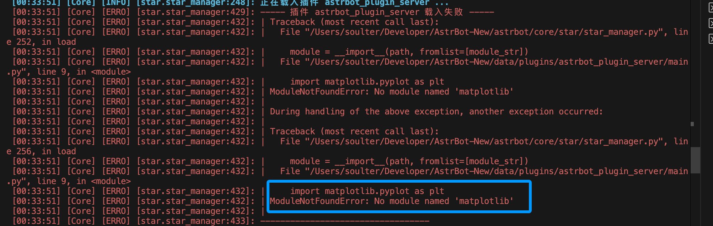
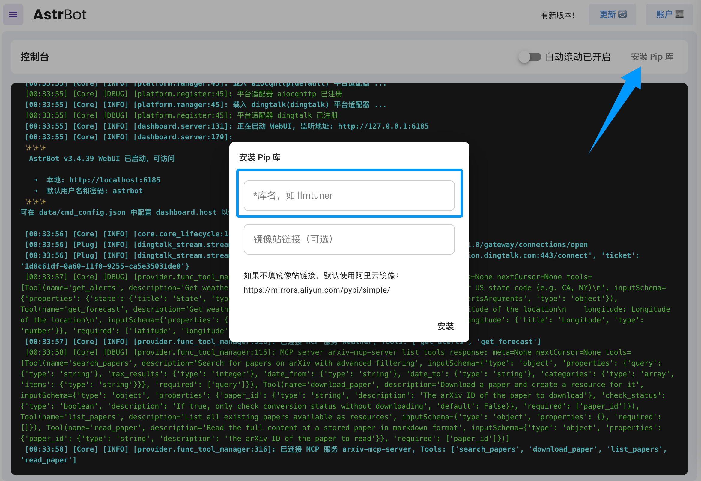

# FAQ

### 插件安装不上

1. 插件通过 github 安装，在国内访问 github 确实有时候连不上。可以挂代理，然后进 其他配置->HTTP代理 设置代理。或者直接下载插件压缩包，然后上传。

### 机器人在群聊无法聊天

1. 群聊情况下，由于防止消息泛滥，不会对每条监听到的消息都回复，请尝试 @ 机器人或者使用唤醒词来聊天，比如默认的 `/`，输入 `/你好`。 

### 没有权限操作管理员指令

1. /reset, /persona, /dashboard_update, /op, /deop, /wl, /dewl 是默认的管理员指令。可以通过 /sid 指令得到用户的ID，然后在配置->其他配置中添加到管理员ID名单中。

### 当管理面板打开时遇到 404 错误

在 [release](https://github.com/Soulter/AstrBot/releases) 页面下载dist.zip，解压拖到 AstrBot/data 下。还不行请重启电脑（来自群里的反馈）

### 本地渲染 Markdown 图片(t2i)时中文乱码

可以自定义字体。详见 -> [#957](https://github.com/Soulter/AstrBot/issues/957#issuecomment-2749981802)

推荐 [Maple Mono](https://github.com/subframe7536/maple-font) 字体。

### 安装插件后报错 `No module named 'xxx'`

这个是因为插件依赖的库没有被正常安装。一般情况下，AstrBot 会在安装好插件后自动为插件安装依赖库，如果出现了以下情况可能造成安装失败：

1. 网络问题导致依赖库无法下载
2. 插件作者没有填写 `requirements.txt` 文件
3. Python 版本不兼容

解决方法：

结合报错信息，参考插件的 README 手动安装依赖库。您可在 AstrBot WebUI 的 `控制台`->`安装 Pip 库` 中安装依赖库。

如果发现插件作者没有填写 `requirements.txt` 文件，请在插件仓库提交 issue，提醒作者补充。