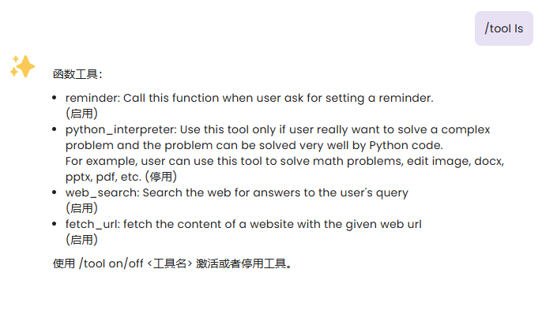

# 基于 Docker 的代码执行器

在 `v3.4.2` 版本及之后，AstrBot 支持代码执行器以强化 LLM 的能力，并实现一些自动化的操作。

## Linux Docker 启动 AstrBot

如果您使用 Docker 部署了 AstrBot，您需要在启动 Docker 容器时，请将 `/var/run/docker.sock` 挂载到容器内部。这样 AstrBot 才能够启动沙箱容器。

```bash
sudo docker run -itd -p 6180-6200:6180-6200 -p 11451:11451 -v $PWD/data:/AstrBot/data -v /var/run/docker.sock:/var/run/docker.sock --name astrbot soulter/astrbot:latest
```
### docker代码执行器报错临时解决办法
可能会遇到以下错误
```
 [14:28:11| WARNING] [main.py:363]: 未从沙箱输出中捕获到合法的输出。沙箱输出日志: ["python: can't open file '/astrbot_sandbox/exec.py': [Errno 2] No such file or directory\n"
```
由于docker.sock实际来自宿主机，在代码执行时，映射只能看到宿主机的地址而非Docker容器内的地址，所以沙箱中的exec.py由于未找到被意外映射成了目录导致执行失败，所以还需要在启动astrbot容器时将代码执行器的路径映射到宿主机内
```bash
sudo docker run -itd -p 6180-6200:6180-6200 -p 11451:11451 -v $PWD/data:/AstrBot/data -v /var/run/docker.sock:/var/run/docker.sock -v /tmp/zfsv3/nvme12/user/data/dockerZone/AstrBot/packages:/AstrBot/packages --name astrbot soulter/astrbot:latest
```
packages被映射后，目录的内容会被清空，所以需要手动下载astrbot的源码，将packages目录的文件重新拷贝进来

最后修改python_interpreter/main.py中代码
```python
            # 启动容器
            docker = aiodocker.Docker()
            
            # 检查有没有image
            image_name = await self.get_image_name()
            try:
                await docker.images.get(image_name)
            except aiodocker.exceptions.DockerError:
                # 拉取镜像
                logger.info(f"未找到沙箱镜像，正在尝试拉取 {image_name}...")
                await docker.images.pull(image_name)
                
            yield event.plain_result(f"使用沙箱执行代码中，请稍等...(尝试次数: {i+1}/{n})")
            hostPath = "/tmp/zfsv3/nvme12/user/data/dockerZone/AstrBot/packages/python_interpreter/"
            hostWorkplacePath = os.path.join(hostPath, "workplace", magic_code)
            hostSharedPath = os.path.join(hostPath, "shared")
            hostOutputPath = os.path.join(hostWorkplacePath,"output")

            container = await docker.containers.run({
                "Image": image_name,
                "Cmd": ["python", "exec.py"],
                "Memory": 512 * 1024 * 1024,
                "NanoCPUs": 1000000000,
                "HostConfig": {
                    "Binds": [
                        f"{hostSharedPath}:/astrbot_sandbox/shared:ro",
                        f"{hostOutputPath}:/astrbot_sandbox/output:rw",
                        f"{hostWorkplacePath}:/astrbot_sandbox:rw",
                    ]
                },
                "Env": [
                    f"MAGIC_CODE={magic_code}"
                ],
                "AutoRemove": False
            })
            
            logger.debug(f"Container {container.id} created.")
            logs, status = await self.run_container(container)
            
            logger.debug(f"Container {container.id} finished. status:{status}")
            logger.debug(f"Container {container.id} logs: {logs}")
```
其中hostPath修改为你映射的宿主机的地址/python_interpreter/
## Linux 手动源码 启动 AstrBot

如果您使用源码部署 AstrBot，并且是 Ubuntu 系的系统，您需要在启动 AstrBot 时，带上 sudo 权限。


## Linux 手动源码 启动 AstrBot

如果您使用源码部署 AstrBot，并且是 Ubuntu 系的系统，您需要在启动 AstrBot 时，带上 sudo 权限。

## 使用

> [!TIP]
> 此功能目前处于实验阶段，可能会有一些问题。如果您遇到了问题，请在 [GitHub](https://github.com/Soulter/AstrBot/issues) 上提交 issue。欢迎加群讨论：[322154837](https://qm.qq.com/cgi-bin/qm/qr?k=EYGsuUTfe00_iOu9JTXS7_TEpMkXOvwv&jump_from=webapi&authKey=uUEMKCROfsseS+8IzqPjzV3y1tzy4AkykwTib2jNkOFdzezF9s9XknqnIaf3CDft)。

如果您要使用此功能，请确保您的机器安装了 `Docker`。因为此功能需要启动专用的 Docker 沙箱环境以执行代码，以防止 LLM 生成恶意代码对您的机器造成损害。

本功能使用的镜像是 `soulter/astrbot-code-interpreter-sandbox`，您可以在 [Docker Hub](https://hub.docker.com/r/soulter/astrbot-code-interpreter-sandbox) 上查看镜像的详细信息。

镜像中提供了常用的 Python 库：

- Pillow
- requests
- numpy
- matplotlib
- scipy
- scikit-learn
- beautifulsoup4
- pandas
- opencv-python
- python-docx
- python-pptx
- pymupdf
- mplfonts

基本上能够实现的任务：

- 图片编辑
- 网页抓取等
- 数据分析、简单的机器学习
- 文档处理，如读写 Word、PPT、PDF 等
- 数学计算，如画图、求解方程等

由于中国大陆无法访问 docker hub，因此如果您的环境在中国大陆，请使用 `/pi mirror` 来查看/设置镜像源。比如，截至本文档编写时，您可以使用 `cjie.eu.org` 作为镜像源。即设置 `/pi mirror cjie.eu.org`。

在第一次触发代码执行器时，AstrBot 会自动拉取镜像，这可能需要一些时间。请耐心等待。

镜像可能会不定时间更新以提供更多的功能，因此请定期查看镜像的更新。如果需要更新镜像，可以使用 `/pi repull` 命令重新拉取镜像。

> [!TIP]
> 如果一开始没有正常启动此功能，在启动成功之后，需要执行 `/tool on python_interpreter` 来开启此功能。
> 您可以通过 `/tool ls` 查看所有的工具以及它们的启用状态。



## 文件输入/输出

代码执行器除了能够识别和处理图片、文字任务，还能够识别您发送的文件，并且能够发送文件。但是，目前来说有一些环境上的限制。

文件输入/输出只支持 `QQ` 平台，并且使用 `napcat`，并且非 Docker 部署 napcat。


## Demo


