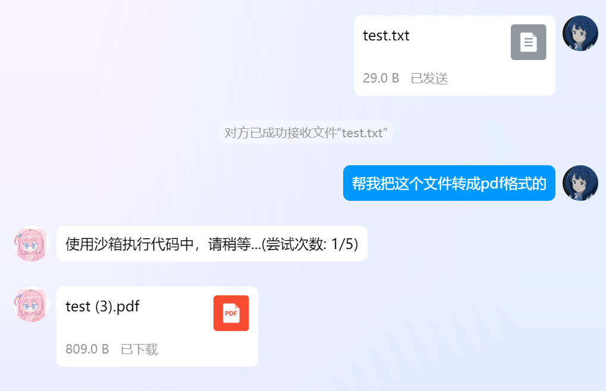

# 基于 Docker 的代码执行器

在 `v3.4.2` 版本及之后，AstrBot 支持代码执行器以强化 LLM 的能力，并实现一些自动化的操作。

## Demo

## 使用

> [!TIP]
> 此功能目前处于实验阶段，可能会有一些问题。如果您遇到了问题，请在 [GitHub](https://github.com/Soulter/AstrBot/issues) 上提交 issue。欢迎加群讨论：[322154837](https://qm.qq.com/cgi-bin/qm/qr?k=EYGsuUTfe00_iOu9JTXS7_TEpMkXOvwv&jump_from=webapi&authKey=uUEMKCROfsseS+8IzqPjzV3y1tzy4AkykwTib2jNkOFdzezF9s9XknqnIaf3CDft)。

如果您要使用此功能，请确保您的机器安装了 `Docker`。因为此功能需要启动专用的 Docker 沙箱环境以执行代码，以防止 LLM 生成恶意代码对您的机器造成损害。

本功能使用的镜像是 `soulter/astrbot-code-interpreter-sandbox`，您可以在 [Docker Hub](https://hub.docker.com/r/soulter/astrbot-code-interpreter-sandbox) 上查看镜像的详细信息。

镜像中提供了常用的 Python 库：

- Pillow
- requests
- numpy
- matplotlib
- scipy
- scikit-learn
- beautifulsoup4
- pandas
- opencv-python
- python-docx
- python-pptx
- pymupdf
- mplfonts

基本上能够实现的任务：

- 图片编辑
- 网页抓取等
- 数据分析、简单的机器学习
- 文档处理，如读写 Word、PPT、PDF 等
- 数学计算，如画图、求解方程等

由于中国大陆无法访问 docker hub，因此如果您的环境在中国大陆，请使用 `/pi mirror` 来查看/设置镜像源。比如，截至本文档编写时，您可以使用 `cjie.eu.org` 作为镜像源。即设置 `/pi mirror cjie.eu.org`。

在第一次触发代码执行器时，AstrBot 会自动拉取镜像，这可能需要一些时间。请耐心等待。

镜像可能会不定时间更新以提供更多的功能，因此请定期查看镜像的更新。如果需要更新镜像，可以使用 `/pi repull` 命令重新拉取镜像。

## 文件输入/输出

代码执行器除了能够识别和处理图片、文字任务，还能够识别您发送的文件，并且能够发送文件。但是，目前来说有一些环境上的限制。

文件输入/输出只支持 `QQ` 平台，并且使用 `napcat`。