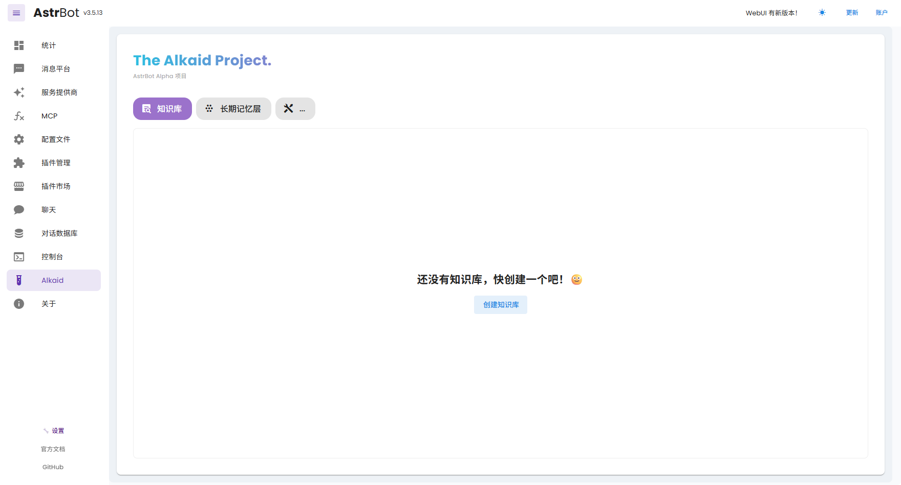
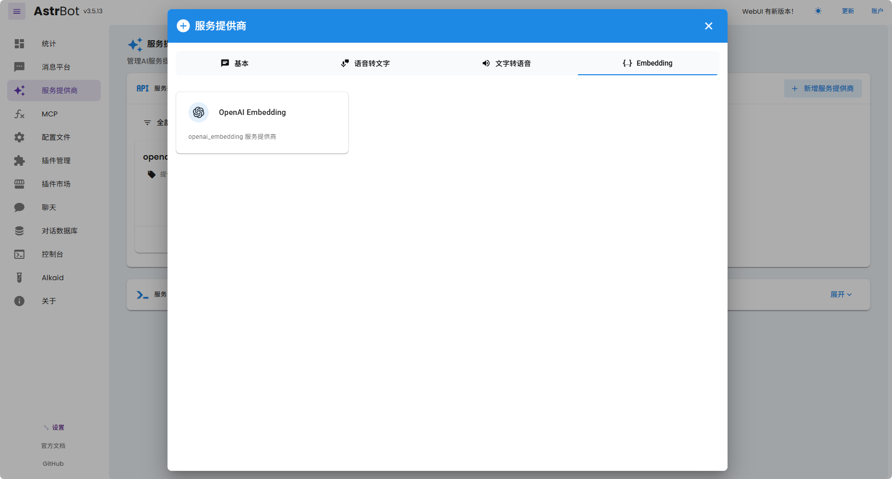
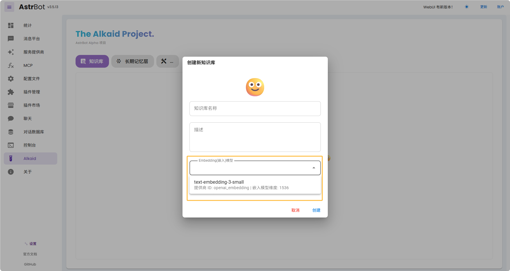
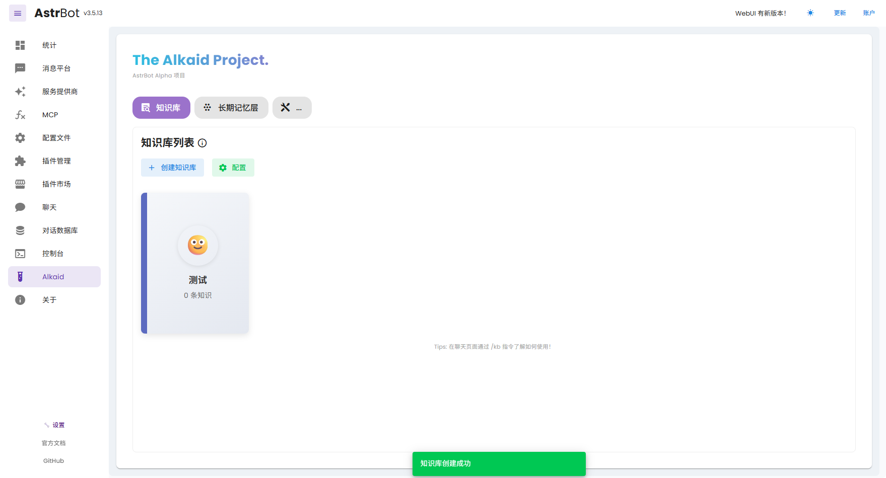
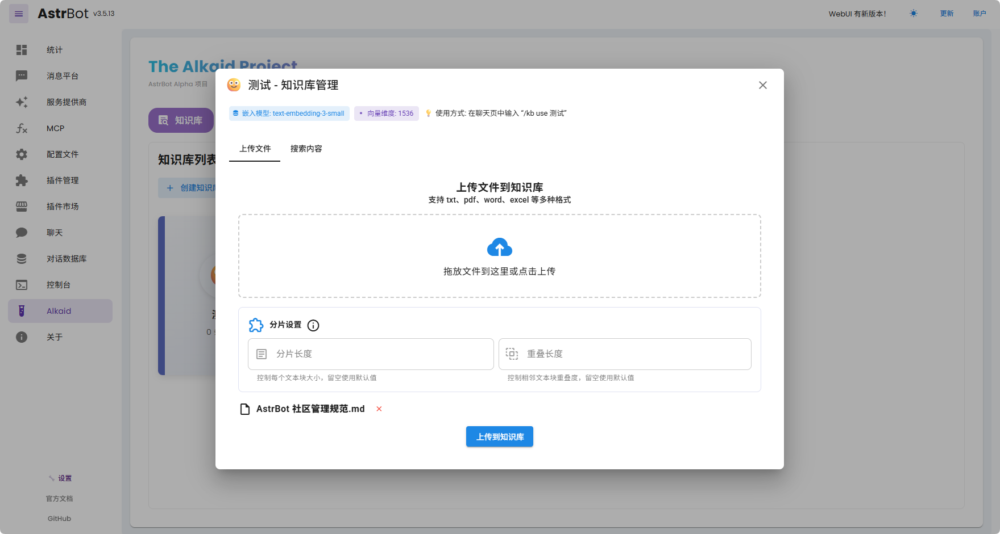
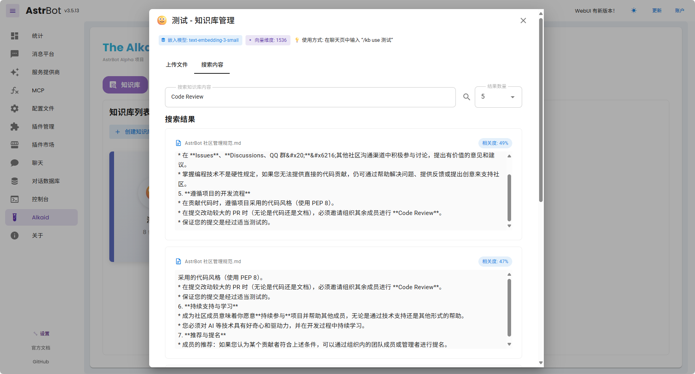

# AstrBot 知识库

> [!TIP]
> 需要 AstrBot 版本 >= 3.5.13，并且 WebUI 已经同步升级至最新版本。

## 简介

AstrBot 提供了开箱即用的知识库功能。

## 安装

为了保证主线依赖的精简性，AstrBot 的知识库能力采用插件的形式提供，您需要先安装插件。

前往 WebUI，点击 `Alkaid`，进入到 Alkaid 页面，您将看到知识库的选项。

如果显示未安装知识库，请先安装知识库插件。点击安装按钮即可，或者前往插件市场安装 `astrbot_plugin_knowledge_base` 插件。由于依赖较大，可能需要安装数分钟，请耐心等待，如果安装过程中发生了错误，请提交 Issue 至 [AstrBot Issues](https://github.com/AstrBotDevs/AstrBot/issues)。

安装成功后，您将看到如下界面：

## 配置嵌入模型

打开服务提供商，点击新增服务提供商，选择 Embedding，如下图所示：

目前 AstrBot 仅支持兼容 OpenAI API 的嵌入向量服务，如 OpenAI、Ollama 等。

点击上面的提供商卡片进入配置页面，填写配置。

> [!TIP]
> 请再三确保您所填写的**模型名称**和**嵌入维度**是否正确！常见的维度大小有：768, 1024, 1536, 3072。

配置完成后，点击保存。

## 创建知识库

AstrBot 支持多知识库管理。在聊天时，您可以**自由指定知识库**。

前往 WebUI，点击 `Alkaid`，进入到 Alkaid 页面，点击创建知识库，如下图所示：

填写相关信息。在嵌入模型下拉菜单中您将看到刚刚创建好的嵌入模型提供商。

> [!TIP]
> 一旦选择了一个知识库的嵌入模型，请不要再修改该提供商的**模型**或者**向量维度信息**，否则将**严重影响**该知识库的召回率甚至**报错**。

创建好后，如下图所示：

## 上传文件

点击要上传文件的知识库，拖拽或者点击上传您想要导入的文件。

> [!TIP]
> AstrBot 知识库使用 Markitdown 来将非文本文件转换成大模型友好的 Markdown 格式。
> 您可以上传的文件格式如下：md, txt, docx, xlsx, pptx 等等。其中，最兼容的是 md 和 txt。

点击上传到知识库即可开始上传。对于大文件，这可能需要一些时间。您可以开一个新的 WebUI 标签页，在控制台处查看进度。如果有报错并且无法解决，请提交 Issue 至 [AstrBot Issues](https://github.com/AstrBotDevs/AstrBot/issues)。

上传成功时，下方会弹出绿色的提示。

## 测试和使用

您可以点击 `搜索内容` 立刻开始测试可用性（不会使用 LLM），如下图所示：

在聊天页面，请使用 `/kb use 知识库名称` 来切换。详细的操作指令可以参考 `/kb help`

## 反馈

这是一个新功能。如果有报错并且无法解决，请提交 Issue 至 [AstrBot Issues](https://github.com/AstrBotDevs/AstrBot/issues)。

## 附录

1. AstrBot 知识库插件仓库地址：[astrbot_plugin_knowledge_base](https://github.com/lxfight/astrbot_plugin_knowledge_base)
2. Made with ❤ by **[@lxfight](https://github.com/lxfight)** and [@Soulter](https://github.com/Soulter) and [@Yxiguan](https://github.com/Yxiguan) and [@TheAnyan](https://github.com/TheAnyan).