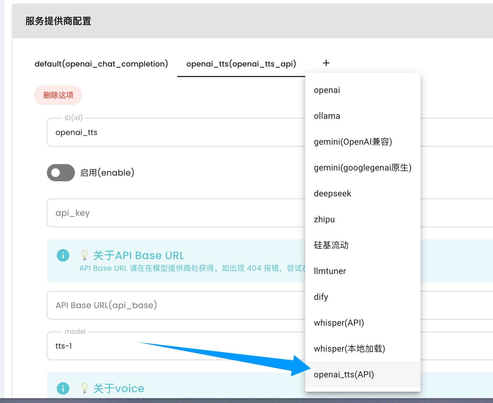
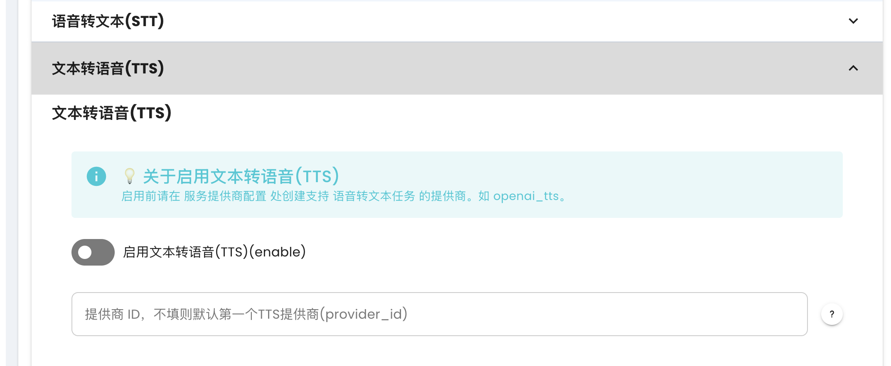

# 接入 OpenAI TTS

> 暂不支持 qq_official，参考 [AstrBot 适配情况](https://github.com/Soulter/AstrBot?tab=readme-ov-file#-%E6%B6%88%E6%81%AF%E5%B9%B3%E5%8F%B0%E6%94%AF%E6%8C%81%E6%83%85%E5%86%B5)

AstrBot 支持接入 OpenAI TTS 模型，实现文字转语音。

也支持适配了 OpenAI TTS API 的第三方 TTS 服务。

如果你想使用 OpenAI TTS 服务，你需要一个 OpenAI API Key 或者使用中转服务（推荐 chatanywhere 或者 AiHubMix ）。

## 配置 OpenAI TTS

添加，然后填写相关的配置项，保存即可。

## 启用 TTS

在这里启用即可。