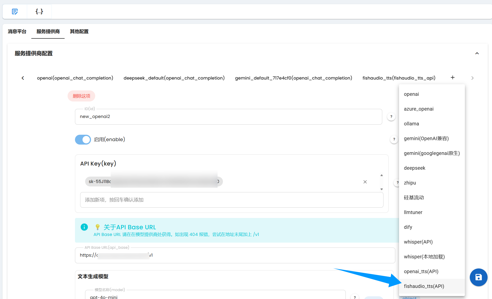
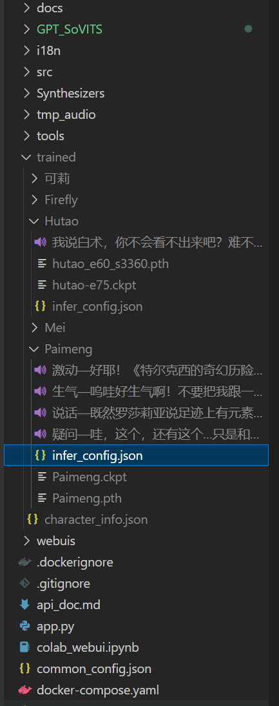
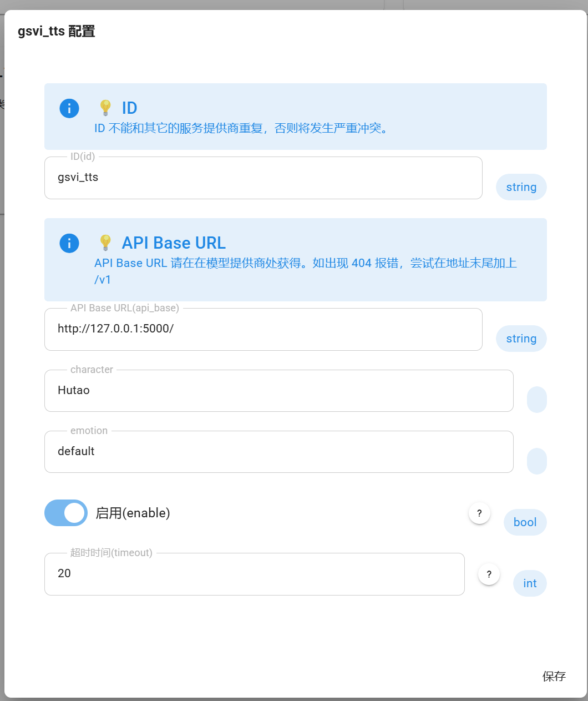

# 使用文字转语音

> 暂不支持 qq_official，参考 [AstrBot 适配情况](https://github.com/Soulter/AstrBot?tab=readme-ov-file#-%E6%B6%88%E6%81%AF%E5%B9%B3%E5%8F%B0%E6%94%AF%E6%8C%81%E6%83%85%E5%86%B5)

AstrBot 目前原生支持接入 OpenAI、Fish Audio TTS 模型，实现文字转语音。也支持适配了 OpenAI TTS API 的第三方 TTS 服务。如果你想使用 OpenAI TTS 服务，你需要一个 OpenAI API Key 或者使用中转服务（推荐 chatanywhere 或者 AiHubMix ）。

## 配置 OpenAI TTS


添加，然后填写相关的配置项。

> [!TIP]
> 如果控制台提示未安装 `whisper` 库，请先点击管理面板->控制台页右上角的 `安装 Pip 库` 按钮安装此库。


## 配置 Fish Audio TTS

官网：https://fish-audio.cn/

Fish Audio 是一个小样本 TTS, 能快速生成 TTS 语音, 其团队包含了 GPT-Sovits 的创始人。 Fish Audio 还推出了线上 API。

首先，请登录官网注册账号，然后进入 [API Key](https://fish-audio.cn/zh-CN/go-api/api-keys/) 申请一个 API Key。

进入[账单](https://fish-audio.cn/zh-CN/go-api/billing/)，可以找到申请试用额度，点击申请即可，如果没有额度，可以充值。

在 AstrBot：



然后填入你的 API Key。

> [!TIP]
> 如果控制台提示未安装 `ormsgpack` 库，请先点击管理面板->控制台页右上角的 `安装 Pip 库` 按钮安装此库。

## 配置 GSVI(GPT-SoVITS-Inference) TTS
官网：https://github.com/X-T-E-R/GPT-SoVITS-Inference

GSVI 是一个基于 GPT-SoVITS 构建的推理专用插件，旨在通过用户友好的 API 界面增强您的文本转语音 （TTS） 体验。
由于原项目 GPT-SoVITS 并不方便提供 API 服务，因此使用的是 GSVI。

首先需要部署 GSVI 服务，具体的环境配置步骤请参考 [GSVI 官方文档](https://www.yuque.com/xter/zibxlp/nqi871glgxfy717e)。
> 注：本文档不涉及具体的环境配置步骤。

在项目根目录下创建一个`trained`目录，用于存放模型，



将不同的人物存放至不同的文件夹，GSVI 在读取的人物名称就是 trained 目录下的子目录名称，每个人物文件夹下要包括参考音频，GPT 模型，SoVITS 模型以及推理配置文件（infer_config.json）。
以下是 infer_config.json 的参考配置：

```json
{
    "gpt_path": "Paimeng.ckpt",
    "sovits_path": "Paimeng.pth",
    "software_version": "1.1",
    "简介": "这是一个配置文件适用于https://github.com/X-T-E-R/TTS-for-GPT-soVITS，是一个简单好用的前后端项目",
    "emotion_list": {
        "default": {
            "ref_wav_path": "说话—既然罗莎莉亚说足迹上有元素力，用元素视野应该能很清楚地看到吧。.wav",
            "prompt_text": "说话—既然罗莎莉亚说足迹上有元素力，用元素视野应该能很清楚地看到吧。",
            "prompt_language": "多语种混合"
        },
        "angry": {
            "ref_wav_path": "生气—呜哇好生气啊！不要把我跟一斗相提并论！.wav",
            "prompt_text": "呜哇好生气啊！不要把我跟一斗相提并论！",
            "prompt_language": "多语种混合"
        },
        "excited": {
            "ref_wav_path": "激动—好耶！《特尔克西的奇幻历险》出发咯！.wav",
            "prompt_text": "好耶！《特尔克西的奇幻历险》出发咯！",
            "prompt_language": "多语种混合"
        },
        "confused": {
            "ref_wav_path": "疑问—哇，这个，还有这个…只是和史莱姆打了一场，就有这么多结论吗？.wav",
            "prompt_text": "哇，这个，还有这个…只是和史莱姆打了一场，就有这么多结论吗？",
            "prompt_language": "多语种混合"
        }
    }
}
```

配置说明：
- `gpt_path`：GPT 模型文件路径
- `sovits_path`：SoVITS 模型文件路径
- `emotion_list`：情绪配置列表，包含各种情绪状态对应的参照文本和音频


完成配置后，执行以下命令启动 API 服务：
```bash
python pure_api.py
```
> 注：使用 pure_api.py 而非 GUI 版本，因为我们只需要 API 功能

然后在 AstrBot 中启用，



- **API base URL**：GSVI 服务器地址（本地部署使用默认值即可）
- **character**：trained 目录下的角色名称
- **emotion**：对应角色配置中的情绪标识（如 angry、excited 等）


## 启用 TTS


在这里点击启用，然后保存配置。

如果启用了 TTS，在请求大模型得到文本回复之后，将会自动调用所启用的 TTS 服务。控制台会输出 `TTS 请求: xxx` 的 INFO 级别日志。