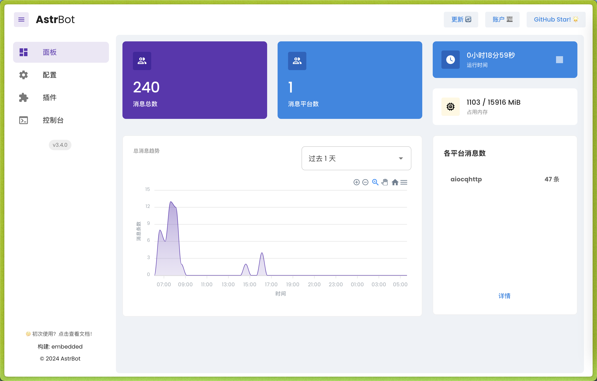
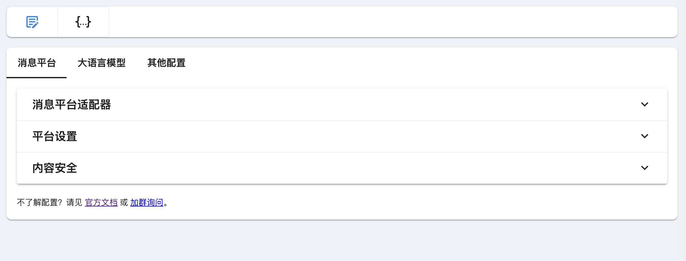
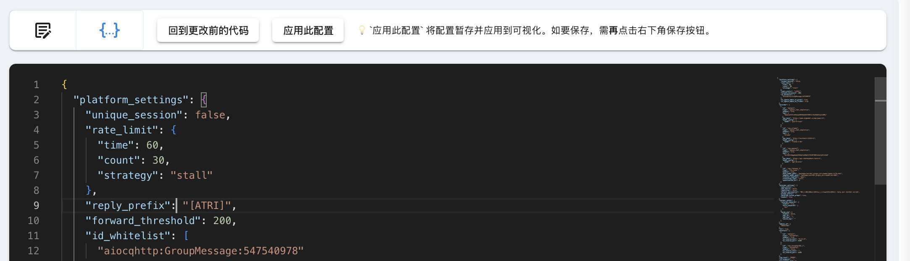
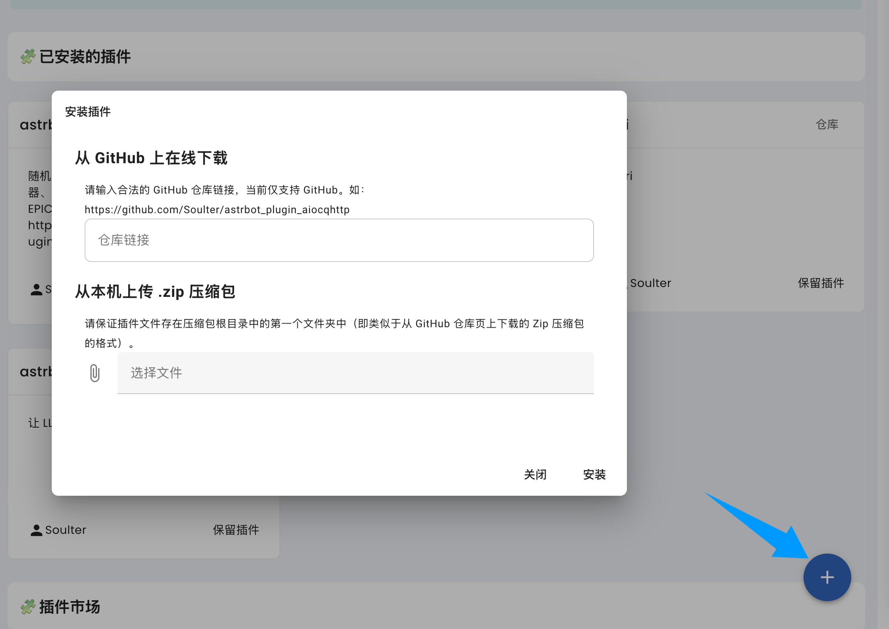

# 管理面板

AstrBot 管理面板具有管理插件、查看日志、可视化配置、查看统计信息等功能。

> [!TIP]
> 图中显示占用内存有 1GB 是因为此时 AstrBot 加载了一个自部署的微调大语言模型。

## 管理面板的访问

当启动 AstrBot 之后，你可以通过浏览器访问 `http://localhost:6185` 来访问管理面板。

> [!TIP]
> - 如果你正在云服务器上部署 AstrBot，需要将 `localhost` 替换为你的服务器 IP 地址。

## 登录

默认用户名和密码是 `astrbot` 和 `astrbot`。

## 可视化配置

在管理面板中，你可以通过可视化配置来配置 AstrBot 的插件。点击左栏 `配置` 即可进入配置页面。

顶部的两个按钮可以切换`可视化编辑配置`和`代码编辑配置`。

在`可视化编辑配置`中，当修改完配置后，需要点击右下角`保存`按钮来保存配置。

在`代码编辑配置`中，你可以直接编辑配置文件，编辑完后首先点击`应用此配置`，此时配置将应用到可视化配置中，然后再点击右下角`保存`按钮来保存配置。

> [!WARNING]
> 请注意，当你在`代码编辑配置`中编辑配置文件时，如果你不点击`应用此配置`，那么你的修改将不会生效。

## 插件

在管理面板中，你可以通过左栏的 `插件` 来查看已安装的插件。

点击右下角的添加按钮，可以安装插件。

