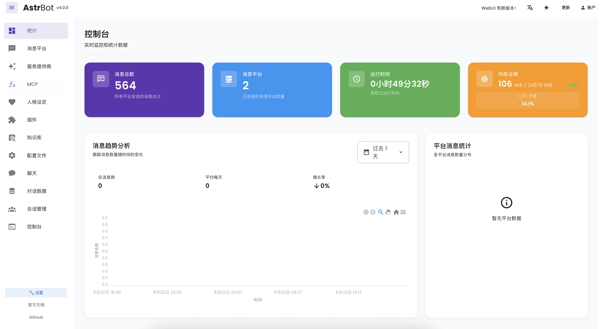
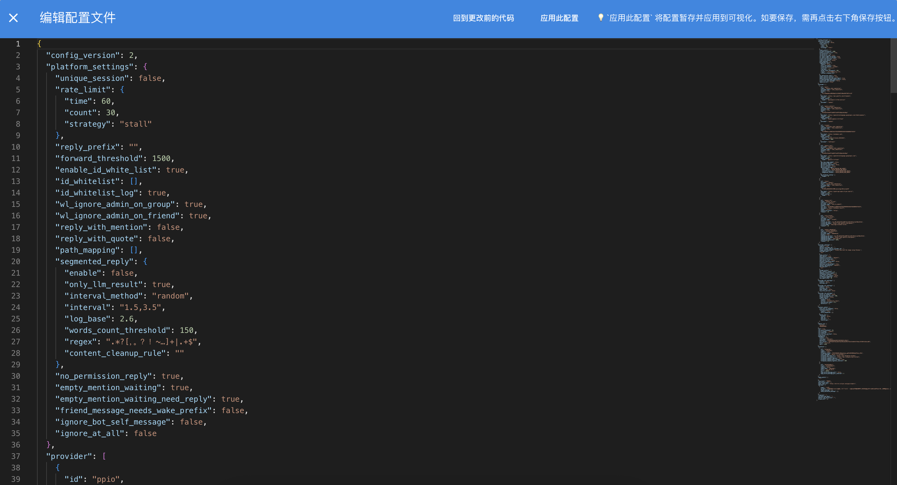

# 管理面板

AstrBot 管理面板具有管理插件、查看日志、可视化配置、查看统计信息等功能。

## 管理面板的访问

当启动 AstrBot 之后，你可以通过浏览器访问 `http://localhost:6185` 来访问管理面板。

> [!TIP]
> - 如果你正在云服务器上部署 AstrBot，需要将 `localhost` 替换为你的服务器 IP 地址。

## 登录

默认用户名和密码是 `astrbot` 和 `astrbot`。

## 可视化配置

在管理面板中，你可以通过可视化配置来配置 AstrBot 的插件。点击左栏 `配置` 即可进入配置页面。

当修改完配置后，你需要点击右下角 `保存` 按钮才能成功保存配置。

使用右下角第一个圆形按钮可以切换至 `代码编辑配置`。在 `代码编辑配置` 中，你可以直接编辑配置文件。

编辑完后首先点击`应用此配置`，此时配置将应用到可视化配置中，然后再点击右下角`保存`按钮来保存配置。如果你不点击`应用此配置`，那么你的修改将不会生效。

## 插件

在管理面板中，你可以通过左栏的 `插件` 来查看已安装的插件，以及安装新插件。

点击插件市场标签栏，你可以浏览由 AstrBot 官方上架的插件。

你也可以点击右下角 + 按钮，以 URL / 文件上传的方式手动安装插件。

> 由于插件更新机制，AstrBot Team 无法完全保证插件市场中插件的安全性，请您仔细甄别。因为插件原因造成损失的，AstrBot Team 不予负责。

## 更新管理面板

在 AstrBot 启动时，会自动检查管理面板是否需要更新，如果需要，第一条日志（黄色）会进行提示。

使用 `/dashboard_update` 命令可以手动更新管理面板（管理员指令）。

管理面板文件在 data/dist 目录下。如果需要手动替换，请在 https://github.com/AstrBotDevs/AstrBot/releases/ 下载 `dist.zip` 然后解压到 data 目录下。

## 自定义 WebUI 端口

修改 data/cmd_config.json 文件内 `dashboard` 配置中的 `port`。

## 忘记密码

修改 data/cmd_config.json 文件内 `dashboard` 配置中的 `password`，将 password 整个键值对删除。
