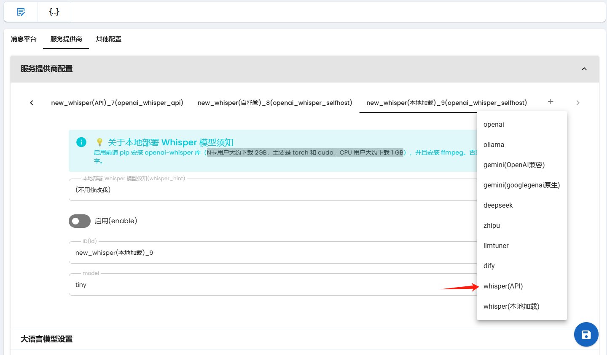

## 接入 Whisper 语音转文字

> [!TIP]
> 如果您使用 Docker 部署 AstrBot，`目前`将无法接收到 QQ 的语音消息，因为无法访问宿主机文件系统。

AstrBot 支持接入 Whisper 语音转文字。

有两种接入方式，一种是使用 OpenAI API 的 Whisper API 接口，另一种是在本地部署 Whisper。

### API 接入

和接入支持 OpenAI API 的大语言模型提供商一样，OpenAI API 也提供了调用 Whisper 模型的 API 接口。

配置文件类似：

```json
{
    "id": "new_whisper(api)",
    "type": "openai_whisper_api",
    "enable": false,
    "api_key": "your_openai_api_key",
    "api_base": "your openai api base",
    "model": "whisper-1"
},
```

在管理面板上配置，只需要点击此项即可可视化配置:



如果你使用 OpenAI 中转服务，请确保你的 OpenAI 的中转服务商支持 Whisper 调用。

### 本地部署

本地运行 Whisper 模型需要 `openai-whisper` 的 Python 库，请先 Pip 安装。

> [!TIP]
> 可以在管理面板 `控制台` 页快捷 pip 安装。
> 安装此库会自动安装 Pytorch（一个深度学习库）。N 卡用户大约下载 2GB，主要是 torch 和 cuda，CPU 用户大约下载 1 GB。

除了安装 `openai-whisper` 库，还需要你的设备上安装有 `ffmpeg`。

对于 Linux，大多数包管理器都有 ffmpeg，可以直接安装。

对于 Windows，可以从 [ffmpeg 官网](https://ffmpeg.org/download.html) 下载。下载完成后建议重启电脑以使环境变量生效。

```
{
    "id": "new_whisper(本地加载)",
    "type": "openai_whisper_selfhost",
    "enable": true,
    "model": "tiny"
},
```

在管理面板上配置，只需要点击此项的后面那项即可可视化配置:


Whisper 有多种模型，默认启用最小的 `tiny` 模型，如果你的设备性能较好，可以尝试使用其他模型。

模型列表：

|  模型名  | 参数量 | English-only model | Multilingual model | 需要的显存 | Relative speed |
|:------:|:----------:|:------------------:|:------------------:|:-------------:|:--------------:|
|  tiny  |    39 M    |     `tiny.en`      |       `tiny`       |     ~1 GB     |      ~10x      |
|  base  |    74 M    |     `base.en`      |       `base`       |     ~1 GB     |      ~7x       |
| small  |   244 M    |     `small.en`     |      `small`       |     ~2 GB     |      ~4x       |
| medium |   769 M    |    `medium.en`     |      `medium`      |     ~5 GB     |      ~2x       |
| large  |   1550 M   |        N/A         |      `large`       |    ~10 GB     |       1x       |
| turbo  |   809 M    |        N/A         |      `turbo`       |     ~6 GB     |      ~8x       |