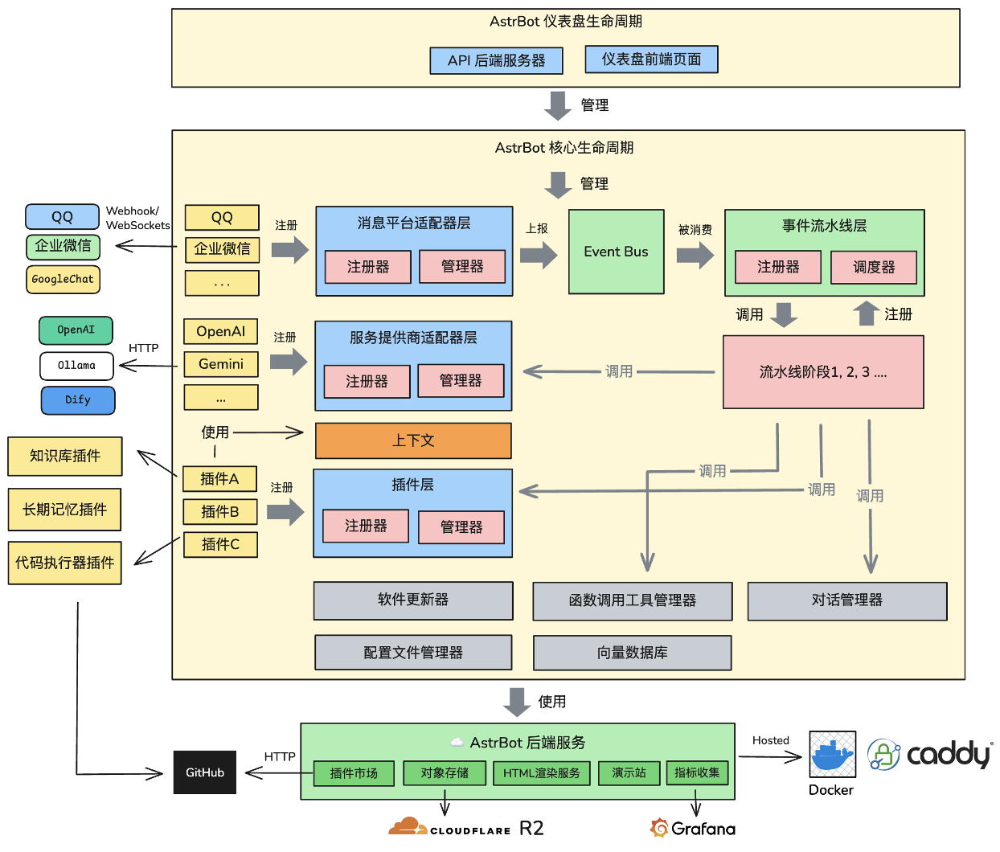

# AstrBot
 
## 什么是 AstrBot？

AstrBot 是一个易于上手的多平台聊天机器人及开发框架。通过它，你能够在多种消息平台上部署一个支持大语言模型（LLM）的聊天机器人。并以此实现但不限于 AI 知识库问答、角色扮演、群聊管理、LLM Agent 等功能。它有如下特性

- **松耦合**：AstrBot 历经 3 次大代码重构。每一次都在向着松耦合、模块化的方向迈进。目前，AstrBot 采用了事件总线和消息事件流水线的架构设计，实现近乎完全的模块化。

- **异步**：AstrBot 采用了异步编程模型，使得 AstrBot 在处理多个消息平台的消息时，能够更加高效。

- **多消息平台部署**：AstrBot 默认支持接入 QQ、QQ频道、微信。通过插件，还可以接入 Telegram 等任何消息平台。

- **完善的插件系统**：AstrBot 提供了完善、及其易于上手的插件系统，你可以通过插件实现自己的功能。开发一个插件，只需要几行代码。

## 它是如何实现的？

下面的拓扑图基本简述了 AstrBot 的架构。

## 说明

AstrBot 受 [AGPL-v3](https://www.chinasona.org/gnu/agpl-3.0-cn.html) 开源许可证保护。如果您对 AstrBot 进行了修改并将其用于提供具有商业性质的网络服务，您必须开源所做的修改，否则将构成对许可证的违反，我们将保留对违反许可证条款的行为追究法律责任的权利。如您希望在闭源情况下进行商业使用，可联系 [community@astrbot.app](mailto:community@astrbot.app) 申请商业授权。